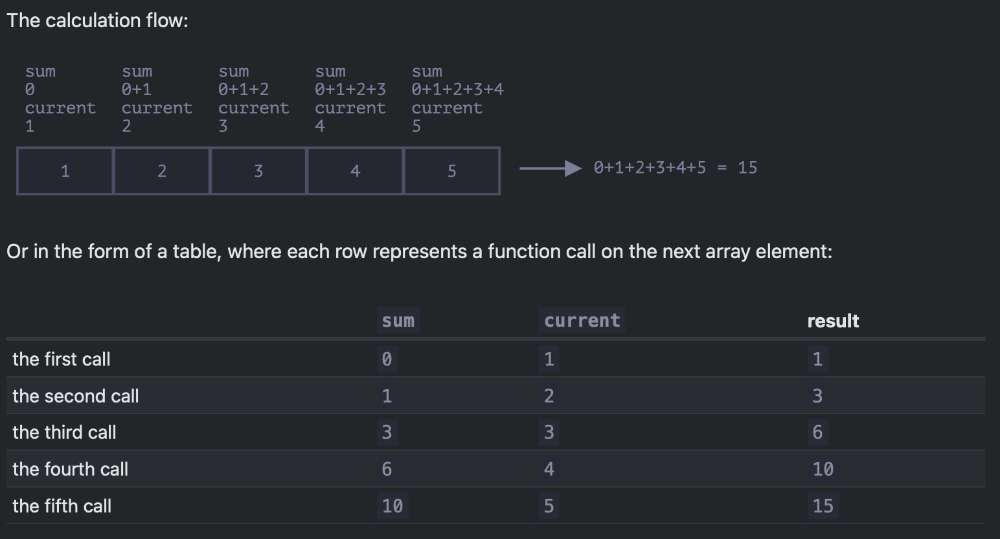
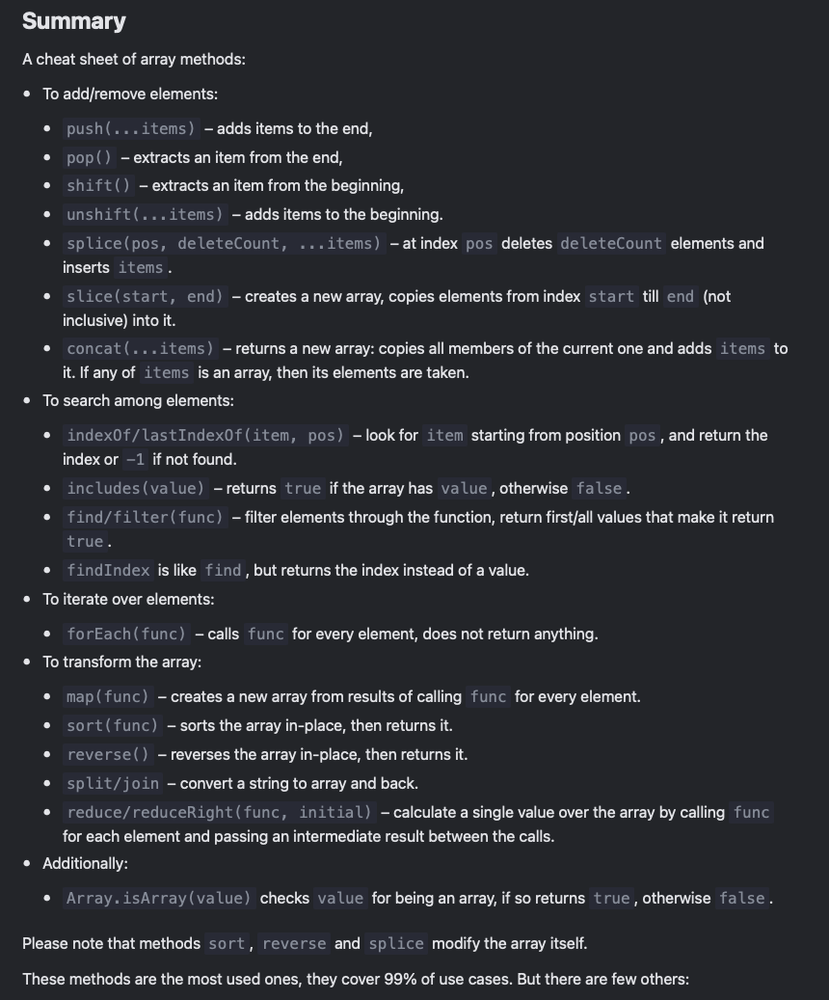
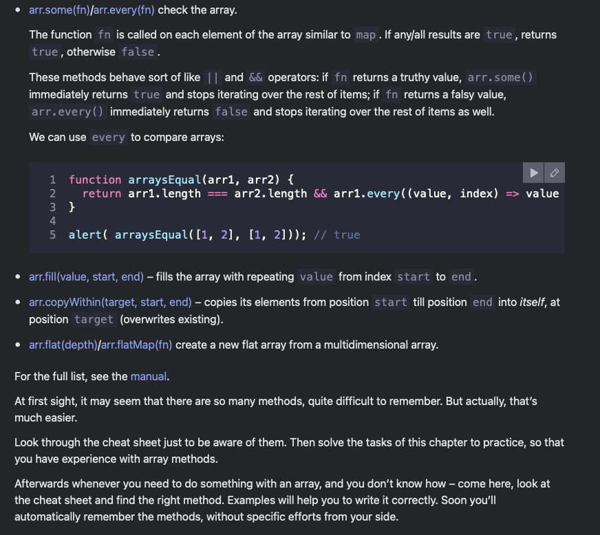

# Array methods

## Add/remove items

- str.push()
- str.pop()
- str.shift()
- str.unshift()

### splice

- insert, remove, replace elements

```javascript
arr.splice(start[, deleteCount, elem1, ..., elemN])
```

- it modifies ```arr``` starting from the index ```start```: removes ```deleteCount``` elements and then inserts ```elem1, ..., elemN``` at their place. ```Returns``` the array of removed elements.

```js
let arr = ["I", "study", "JavaScript"];

arr.splice(1, 1); // from index 1 remove 1 element

alert( arr ); // ["I", "JavaScript"]
// Starting from the index 1 it removed 1 element.


let arr = ["I", "study", "JavaScript", "right", "now"];

// remove 3 first elements and replace them with another
arr.splice(0, 3, "Let's", "dance");

alert( arr ) // now ["Let's", "dance", "right", "now"]

let arr = ["I", "study", "JavaScript", "right", "now"];

// remove 2 first elements
let removed = arr.splice(0, 2);

alert( removed ); // "I", "study" <-- array of removed elements


// The splice method is also able to insert the elements without any removals. For that, we need to set deleteCount to 0:

let arr = ["I", "study", "JavaScript"];

// from index 2
// delete 0
// then insert "complex" and "language"
arr.splice(2, 0, "complex", "language");

alert( arr ); // "I", "study", "complex", "language", "JavaScript"

// negative indexes

let arr = [1, 2, 5];

// from index -1 (one step from the end)
// delete 0 elements,
// then insert 3 and 4
arr.splice(-1, 0, 3, 4);

alert( arr ); // 1,2,3,4,5
```

---

### slice

```js
arr.slice([start], [end])
```

- it returns a new array copying to it all items from index start to end (not including end). Both start and end can be negative, in that case position from array end is assumed.

- similar to ```str.slice```, but instead of substrings, it makes subarrays.

```js
let arr = ["t", "e", "s", "t"];

alert( arr.slice(1, 3) ); // e,s (copy from 1 to 3)

alert( arr.slice(-2) ); // s,t (copy from -2 till the end)
```

- calling the arr.slice() without arguments just creates a copy of the array

### concat

- creates a new array that includes values from other arrays and additional items

```js
arr.concat(arg1, arg2...)
```

- accepts any number of values from arrays to values
- if an argument is an array, then all its elements are copied. Otherwise, the argument itself is copied.

```js
let arr = [1, 2];

// create an array from: arr and [3,4]
alert( arr.concat([3, 4]) ); // 1,2,3,4

// create an array from: arr and [3,4] and [5,6]
alert( arr.concat([3, 4], [5, 6]) ); // 1,2,3,4,5,6

// create an array from: arr and [3,4], then add values 5 and 6
alert( arr.concat([3, 4], 5, 6) ); // 1,2,3,4,5,6


let arr = [1, 2];

let arrayLike = {
  0: "something",
  length: 1
};

alert( arr.concat(arrayLike) ); // 1,2,[object Object]

// …But if an array-like object has a special Symbol.isConcatSpreadable property, then it’s treated as an array by concat: its elements are added instead:

let arr = [1, 2];

let arrayLike = {
  0: "something",
  1: "else",
  [Symbol.isConcatSpreadable]: true,
  length: 2
};

alert( arr.concat(arrayLike) ); // 1,2,something,else
```

### Iterate: forEach

- the ```arr.forEach``` method allows to run a function for every element of the array

```js
arr.forEach(function(item, index, array) {
  // ... do something with an item
});

// for each element call alert
["Bilbo", "Gandalf", "Nazgul"].forEach(alert);

And this code is more elaborate about their positions in the target array:

 ["Bilbo", "Gandalf", "Nazgul"].forEach((item, index, array) => {
  alert(`${item} is at index ${index} in ${array}`);
});
```

- the return value of this integer (if any) is thrown and ignored

## Searching in an array

### indexOf/lastIndexOf and includes

- ```arr.indexOf``` and ```arr.includes``` work on items

- ```arr.indexOf(item, from)``` – looks for ```item``` starting from index ```from```, and returns the index where it was found, otherwise -1.

- ```arr.includes(item, from)``` – looks for ```item``` starting from index ```from```, returns ```true``` if found.

- by default the search is from beginning

```js
let arr = [1, 0, false];

alert( arr.indexOf(0) ); // 1
alert( arr.indexOf(false) ); // 2
alert( arr.indexOf(null) ); // -1

alert( arr.includes(1) ); // true
```

> indexOf uses the strict equality === for comparison. So, if we look for false, it finds exactly false and not the zero.

- if the index is not needed, only the information of its existence in array then arr.includes is preffered

A minor, but noteworthy feature of includes is that it correctly handles NaN, unlike ```indexOf```:

```js
 const arr = [NaN];
alert( arr.indexOf(NaN) ); // -1 (wrong, should be 0)
alert( arr.includes(NaN) );// true (correct)
```

That’s because includes was added to JavaScript much later and uses the more up-to-date comparison algorithm internally.

- arr.lastIndexOf looks from right to left

```js
let fruits = ['Apple', 'Orange', 'Apple']

alert( fruits.indexOf('Apple') ); // 0 (first Apple)
alert( fruits.lastIndexOf('Apple') ); // 2 (last Apple)
```

### find and findIndex/findLastIndex

- finding an object with specific conditions

```js
let result = arr.find(function(item, index, array) {
  // if true is returned, item is returned and iteration is stopped
  // for falsy scenario returns undefined
});
```

The function is called for elements of the array, one after another:

- ```item``` is the element
- ```index``` is its index
- ```array``` is the array itself
- returns item/undefined

```js
// array of users, each with the fields id and name. Let’s find the one with id == 1
let users = [
  {id: 1, name: "John"},
  {id: 2, name: "Pete"},
  {id: 3, name: "Mary"}
];

let user = users.find(item => item.id == 1);

alert(user.name); // John
```

The ```arr.findIndex``` method has the same syntax but returns the index where the element was found instead of the element itself. The value of ```-1``` is returned if nothing is found.

The ```arr.findLastIndex``` method is like ```findIndex```, but searches from right to left, similar to ```lastIndexOf```.

```js
let users = [
  {id: 1, name: "John"},
  {id: 2, name: "Pete"},
  {id: 3, name: "Mary"},
  {id: 4, name: "John"}
];

// Find the index of the first John
alert(users.findIndex(user => user.name == 'John')); // 0

// Find the index of the last John
alert(users.findLastIndex(user => user.name == 'John')); // 3
```

### filter

- looks for a single (first) element that makes the function return true
- returns an array of all matching elements

```js
let results = arr.filter(function(item, index, array) {
  // if true item is pushed to results and the iteration continues
  // returns empty array if nothing found
});

let users = [
  {id: 1, name: "John"},
  {id: 2, name: "Pete"},
  {id: 3, name: "Mary"}
];

// returns array of the first two users
let someUsers = users.filter(item => item.id < 3);

alert(someUsers.length); // 2
```

---

## Transform an array

### map

```arr.map```: calls the function for each element of the array and returns the array of results

```js
let result = arr.map(function(item, index, array) {
  // returns the new value instead of item
});

// here we transform each element into its length:

let lengths = ["Bilbo", "Gandalf", "Nazgul"].map(item => item.length);
alert(lengths); // 5,7,6
```

### sort(fn)

- call to ```arr.sort()``` sorts the array in place, changing its element order

- the items are sorted as strings by default

```js
let arr = [ 1, 2, 15 ];

// the method reorders the content of arr
arr.sort();

alert( arr );  // 1, 15, 2
```

To use our own sorting order, we need to supply a function as the argument of ```arr.sort()```

```js
// The function should compare two arbitrary values and return:

function compare(a, b) {
  if (a > b) return 1; // if the first value is greater than the second
  if (a == b) return 0; // if values are equal
  if (a < b) return -1; // if the first value is less than the second
}

// For instance, to sort as numbers: 

function compareNumeric(a, b) {
  if (a > b) return 1;
  if (a == b) return 0;
  if (a < b) return -1;
}

let arr = [ 1, 2, 15 ];

arr.sort(compareNumeric);

alert(arr);  // 1, 2, 15
```

> Actually, a comparison function is only required to return a positive number to say “greater” and a negative number to say “less”.
>
> That allows to write shorter functions:
>
> let arr = [ 1, 2, 15 ];
>
> arr.sort(function(a, b) { return a - b; });
>
> alert(arr);  // 1, 2, 15
>
> same as above
>
> arr.sort( (a, b) => a - b );

- use localeCompare for strings.

### reverse

- returns the arr after reversal

```js
let arr = [1, 2, 3, 4, 5];
arr.reverse();

alert( arr ); // 5,4,3,2,1
```

### split and join

We are writing a messaging app, and the person enters the comma-delimited list of receivers: ```John, Pete, Mary```. But for us an array of names would be much more comfortable than a single string. How to get it?

The ```str.split(delim)``` method does exactly that. It splits the string into an array by the given delimiter ```delim```.

```js
let names = 'Bilbo, Gandalf, Nazgul';

let arr = names.split(', ');

for (let name of arr) {
  alert( `A message to ${name}.` ); // A message to Bilbo  (and other names)
}

// second optional argument that puts a limit on the array length

let arr = 'Bilbo, Gandalf, Nazgul, Saruman'.split(', ', 2);

alert(arr); // Bilbo, Gandalf


// The call to split(s) with an empty s would split the string into an array of letters:

 let str = "test";

alert( str.split('') ); // t,e,s,t
```

- the ```arr.join(glue)``` does the opposite and and creates a string of arr joined by ```glue```

```js
let arr = ['Bilbo', 'Gandalf', 'Nazgul'];

let str = arr.join(';'); // glue the array into a string using ;

alert( str ); // Bilbo;Gandalf;Nazgul
```

### reduce/reduceRight

- used to calculate a single value based on the array

```js
let value = arr.reduce(function(accumulator, item, index, array) {
  // ...
}, [initial]);
```

Arguments:

- accumulator – is the result of the previous function call, equals initial the first time (if initial is provided).
- item – is the current array item.
- index – is its position.
- array – is the array.

- as the function is applied, the result of the previous function call is passed to the next one as the first argument.

- so, the first argument is essentially the accumulator that stores the combined result of all previous executions. And at the end, it becomes the result of reduce.

```js
let arr = [1, 2, 3, 4, 5];

let result = arr.reduce((sum, current) => sum + current, 0);

alert(result); // 15
```

1. On the first run, sum is the initial value (the last argument of reduce), equals 0, and current is the first array element, equals 1. So the function result is 1.
2. On the second run, sum = 1, we add the second array element (2) to it and return.
3. On the 3rd run, sum = 3 and we add one more element to it, and so on…



```js
let arr = [1, 2, 3, 4, 5];

// removed initial value from reduce (no 0)
let result = arr.reduce((sum, current) => sum + current);

alert( result ); // 15

// when the first argument is not provided, it takes the first value as initial 
// but when the first element or array is empty it gives an error on reduce call

let arr = [];

// Error: Reduce of empty array with no initial value
// if the initial value existed, reduce would return it for the empty arr.
arr.reduce((sum, current) => sum + current);
```

- the method arr.reduceRight does the same but goes from right to left.

### Array.isArray

- based on object so ```typeOf``` cannot distinguish b/w object and arrays

```js
alert(typeof {}); // object
alert(typeof []); // object (same)

// therefore Array.isArray is used

alert(Array.isArray({})); // false
alert(Array.isArray([])); // true
```

### Most methods support "thisArg"

- all methods that call function like ```find, filter, map``` except ```sort``` accept an additional parameter ```thisArg```

```js
arr.find(func, thisArg);
arr.filter(func, thisArg);
arr.map(func, thisArg);
// ...
// thisArg is the optional last argument

// the value of thisArg parameter becomes this or func

let army = {
  minAge: 18,
  maxAge: 27,
  canJoin(user) {
    return user.age >= this.minAge && user.age < this.maxAge;
  }
};

let users = [
  {age: 16},
  {age: 20},
  {age: 23},
  {age: 30}
];

// find users, for who army.canJoin returns true
let soldiers = users.filter(army.canJoin, army);

alert(soldiers.length); // 2
alert(soldiers[0].age); // 20
alert(soldiers[1].age); // 23
```

If in the example above we used users.filter(army.canJoin), then army.canJoin would be called as a standalone function, with this=undefined, thus leading to an instant error.

A call to users.filter(army.canJoin, army) can be replaced with users.filter(user => army.canJoin(user)), that does the same. The latter is used more often, as it’s a bit easier to understand for most people.



