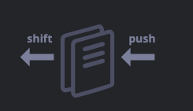
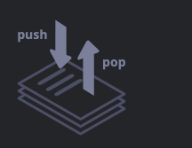
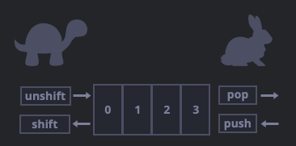
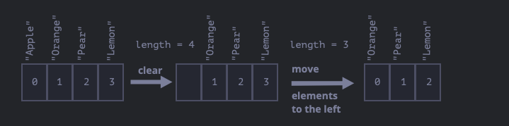
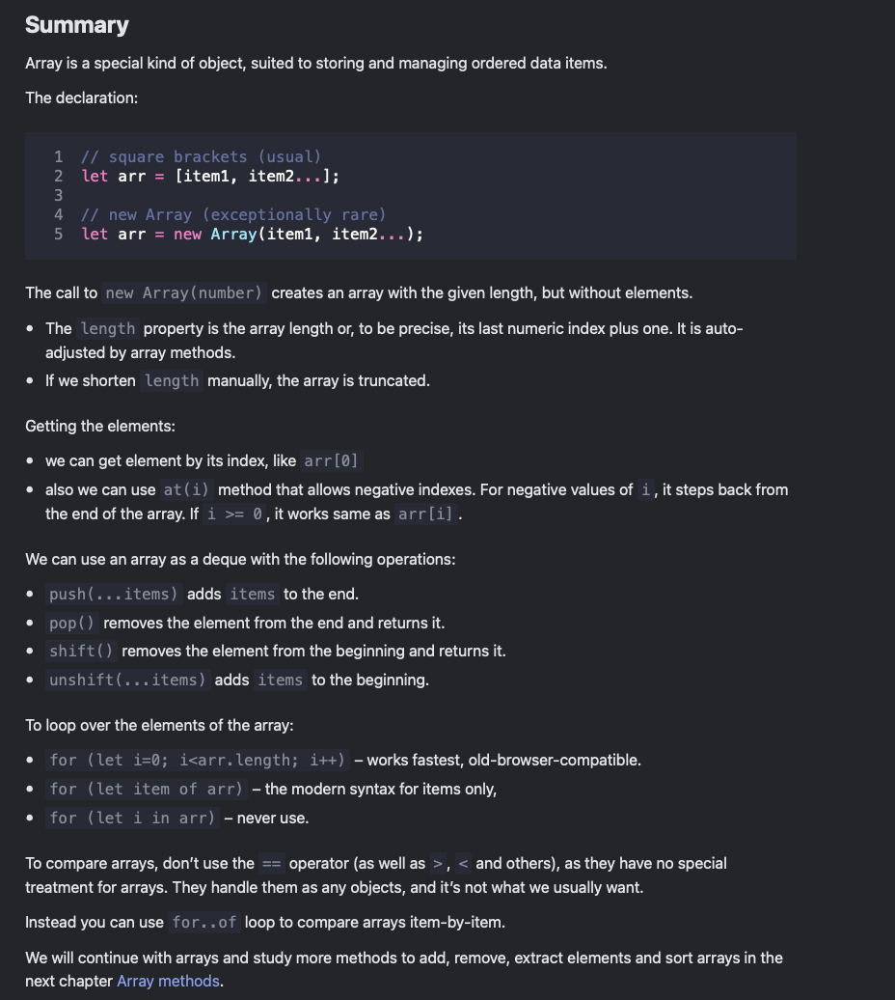

# Arrays

- special kind of object
- stores elements in an ordered way

## Declaration

```js
let arr = new Array();
let arr = [];

alert( fruits[0] ); // Apple
alert( fruits[1] ); // Orange
alert( fruits[2] ); // Plum
fruits[2] = 'Pear'; // now ["Apple", "Orange", "Pear"]
fruits[3] = 'Lemon'; // now ["Apple", "Orange", "Pear", "Lemon"]

let fruits = ["Apple", "Orange", "Plum"];

alert( fruits.length ); // 3


//arrays can contain elements of any type
// mix of values
let arr = [ 'Apple', { name: 'John' }, true, function() { alert('hello'); } ];

// get the object at index 1 and then show its name
alert( arr[1].name ); // John

// get the function at index 3 and run it
arr[3](); // hello
```

## Get last element with "at"

> recent addition to the language, old browsers may need a polyfill

- in JS the negative index does not work and will return undefined as values inside [] are treated literally

- can access by explicilty calculating the index ```arr[arr.length - 1]```

```arr.at(i)```:

- is exactly the same as arr[i], if i >= 0.
- for negative values of i, it steps back from the end of the array.

```js
let fruits = ["Apple", "Orange", "Plum"];

alert( fruits[fruits.length-1] ); // Plum

// using str.at() method

// same as fruits[fruits.length-1]
alert( fruits.at(-1) ); // Plum
```

## Methods, pop, push, shift, unshift

- queue: ordered collection of elements that support two operations :
- push: appends an element to the end of the queue
- shift: extracts an element from the beginning of the queue, advancing all other elements to a lower index.
- FIFO: first in, first out



- stack: ordered collection of elements that support two operations :
- push: appends an element to the end of the stack
- pop: extracts an element from the end of the stack
- LIFO: last in, first out



Arrays in JavaScript can work both as a queue and as a stack. They allow you to add/remove elements, both to/from the beginning or the end.

In computer science, the data structure that allows this, is called deque.

### push and pop (methods that work with the end of the array)

```js
//pop
let fruits = ["Apple", "Orange", "Pear"];

alert( fruits.pop() ); // remove "Pear" and alert it

alert( fruits ); // Apple, Orange

//push 

let fruits = ["Apple", "Orange"];

fruits.push("Pear");

alert( fruits ); // Apple, Orange, Pear
```

### shift and unshift (methods that work with the beginning of the array)

```js
//shift
let fruits = ["Apple", "Orange", "Pear"];
alert( fruits.shift() ); // remove Apple and alert it

alert( fruits ); // Orange, Pear

//unshift
let fruits = ["Orange", "Pear"];

fruits.unshift('Apple');

alert( fruits ); // Apple, Orange, Pear

// adding multiple elements (push, unshift)
let fruits = ["Apple"];

fruits.push("Orange", "Peach");
fruits.unshift("Pineapple", "Lemon");

// ["Pineapple", "Lemon", "Apple", "Orange", "Peach"]
alert( fruits );
```

## Internals

- arrays are objects with special methods and properties
- it is copied by reference

```js
let fruits = ["Banana"]

let arr = fruits; // copy by reference (two variables reference the same array)

alert( arr === fruits ); // true

arr.push("Pear"); // modify the array by reference

alert( fruits ); // Banana, Pear - 2 items now
```

- the internal representation of an array is not specified, but it is optimized for fast access by index and fast addition/removal of elements at the end and is stored in a contigous block of memory by the JS engine.

The ways to misuse an array:

- add a non-numeric property like arr.test = 5.
- make holes, like: add arr[0] and then arr[1000] (and nothing between them).
- fill the array in the reverse order, like arr[1000], arr[999] and so on.

## Performance

- methods push/pop run fast, while shift/unshift are slow



```js
fruits.shift(); // take 1 element from the start
```

It’s not enough to take and remove the element with the index 0. Other elements need to be renumbered as well.

The shift operation must do 3 things:

- remove the element with the index 0.
- move all elements to the left, renumber them from the index 1 to 0, from 2 to 1 and so on.
- update the length property



To extract an element from the end, the pop method cleans the index and shortens length.

- thus push/pop are fast, while shift/unshift are slow

## Loops

```js
let arr = ["Apple", "Orange", "Pear"];

for (let i = 0; i < arr.length; i++) {
  alert( arr[i] );
}


// for..of

let fruits = ["Apple", "Orange", "Plum"];

// iterates over array elements
for (let fruit of fruits) {
  alert( fruit );
}
```

1. The loop for..in iterates over all properties, not only the numeric ones.
    There are so-called “array-like” objects in the browser and in other environments, that look like arrays. That is, they have length and indexes properties, but they may also have other non-numeric properties and methods, which we usually don’t need. The for..in loop will list them though. So if we need to work with array-like objects, then these “extra” properties can become a problem.

2. The for..in loop is optimized for generic objects, not arrays, and thus is 10-100 times slower. Of course, it’s still very fast. The speedup may only matter in bottlenecks. But still we should be aware of the difference.

> Generally, we shouldn’t use for..in for arrays.

## Length

- it is not the count of elements in the array, but the greatest numeric index + 1
- the length property is writable, which on manually increasing show no side effect, but on decreasing it truncates the array

```js
let arr = [1, 2, 3, 4, 5];

arr.length = 2; // truncate to 2 elements
alert( arr ); // [1, 2]

arr.length = 5; // return length back
alert( arr[3] ); // undefined: the values do not return
```

## new Array(n)

- creates an array of length n with empty items, unless specified

```js
let arr = new Array(2); // will it create an array of [2] ?

alert( arr[0] ); // undefined! no elements.

alert( arr.length ); // length 2
```

## Multidimensional arrays

```js
let matrix = [
  [1, 2, 3],
  [4, 5, 6],
  [7, 8, 9]
];

alert( matrix[0][1] ); // 2, the second value of the first inner array
```

## toString

```js
let arr = [1, 2, 3];

alert( arr ); // 1,2,3
alert( String(arr) === '1,2,3' ); // true

alert( [] + 1 ); // "1"
alert( [1] + 1 ); // "11"
alert( [1,2] + 1 ); // "1,21"
```

Arrays do not have Symbol.toPrimitive, neither a viable valueOf, they implement only toString conversion, so here [] becomes an empty string, [1] becomes "1" and [1,2] becomes "1,2".

## not to compare arrays with == or ===

- Two objects are equal == only if they’re references to the same object.
- If one of the arguments of == is an object, and the other one is a primitive, then the object gets converted to primitive, as explained in the chapter Object to primitive conversion.
- …With an exception of null and undefined that equal == each other and nothing else.

```js
alert( [] == [] ); // false
alert( [0] == [0] ); // false

alert( 0 == [] ); // true
alert('0' == [] ); // false

// after [] was converted to ''
alert( 0 == '' ); // true, as '' becomes converted to number 0

alert('0' == '' ); // false, no type conversion, different strings
```


