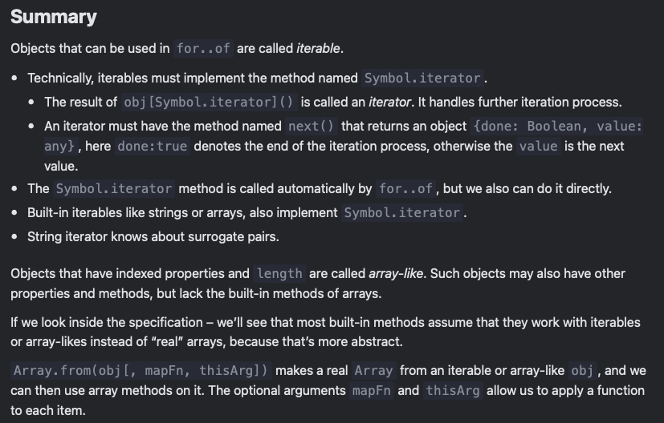

# Iterables (revisit)

- iterable objects are a generalization of arrays or whatever that is supposed to mean?

- a concept that allows us to make any object useable in a ```for..of``` loop

If an object isn’t technically an array, but represents a collection (list, set) of something, then for..of is a great syntax to loop over it, so let’s see how to make it work.

## Symbol.iterator

```js
//a range object that represents an interval of numbers:

let range = {
  from: 1,
  to: 5
};

// We want the for..of to work:
// for(let num of range) ... num=1,2,3,4,5
```

- to make the range object iterable, we need to add a method to the object named Symbol.iterator

1. When for..of starts, it calls that method once (or errors if not found). The method must return an iterator – an object with the method next.
2. Onward, for..of works only with that returned object.
3. When for..of wants the next value, it calls next() on that object.
4. The result of next() must have the form {done: Boolean, value: any}, where done=true means that the loop is finished, otherwise value is the next value.

```js
let range = {
  from: 1,
  to: 5
};

// 1. call to for..of initially calls this
range[Symbol.iterator] = function() {

  // ...it returns the iterator object:
  // 2. Onward, for..of works only with the iterator object below, asking it for next values
  return {
    current: this.from,
    last: this.to,

    // 3. next() is called on each iteration by the for..of loop
    next() {
      // 4. it should return the value as an object {done:.., value :...}
      if (this.current <= this.last) {
        return { done: false, value: this.current++ };
      } else {
        return { done: true };
      }
    }
  };
};

// now it works!
for (let num of range) {
  alert(num); // 1, then 2, 3, 4, 5
}
```

Please note the core feature of iterables: separation of concerns.

The range itself does not have the next() method.
Instead, another object, a so-called “iterator” is created by the call to ```range[Symbol.iterator]()```, and its next() generates values for the iteration.
So, the iterator object is separate from the object it iterates over.

Technically, we may merge them and use range itself as the iterator to make the code simpler.

Like this:

```js
let range = {
  from: 1,
  to: 5,

  [Symbol.iterator]() {
    this.current = this.from;
    return this;
  },

  next() {
    if (this.current <= this.to) {
      return { done: false, value: this.current++ };
    } else {
      return { done: true };
    }
  }
};

for (let num of range) {
  alert(num); // 1, then 2, 3, 4, 5
}
```

Now ```range[Symbol.iterator]()``` returns the range object itself: it has the necessary next() method and remembers the current iteration progress in this.current. Shorter? Yes. And sometimes that’s fine too.

The downside is that now it’s impossible to have two for..of loops running over the object simultaneously: they’ll share the iteration state, because there’s only one iterator – the object itself. But two parallel for-ofs is a rare thing, even in async scenarios.

Infinite iterators are also possible. For instance, the range becomes infinite for range.to = Infinity. Or we can make an iterable object that generates an infinite sequence of pseudorandom numbers. Also can be useful.

There are no limitations on next, it can return more and more values, that’s normal.

Of course, the for..of loop over such an iterable would be endless. But we can always stop it using break.

## String is iterable

- for a string, for...of loops over its characters

```js
for (let char of "test") {
  // triggers 4 times: once for each character
  alert( char ); // t, then e, then s, then t
}

//And it works correctly with surrogate pairs!

 let str = '𝒳😂';
for (let char of str) {
    alert( char ); // 𝒳, and then 😂
}
```

## Calling an iterator explicitly

- this code creates a string iterator and gets values from it “manually”:

```js
let str = "Hello";

// does the same as
// for (let char of str) alert(char);

let iterator = str[Symbol.iterator]();

while (true) {
  let result = iterator.next();
  if (result.done) break;
  alert(result.value); // outputs characters one by one
}
```

## Iterables and array-likes

- iterables are objects that implement the Symbol.iterator method, as described above.

- array-likes are objects that have indexes and length, so they look like arrays.

## Array.form

- takes an iterable or array-like value and makes a “real” Array from it. Then we can call array methods on it.

```js
let arrayLike = {
  0: "Hello",
  1: "World",
  length: 2
};

let arr = Array.from(arrayLike); // (*)
alert(arr.pop()); // World (method works)


// The same happens for an iterable:

 // assuming that range is taken from the example above
let arr = Array.from(range);
alert(arr); // 1,2,3,4,5 (array toString conversion works)
```

Array.from at the line (*) takes the object, examines it for being an iterable or array-like, then makes a new array and copies all items to it.

The full syntax for Array.from also allows us to provide an optional “mapping” function:

```Array.from(obj[, mapFn, thisArg])```
The optional second argument mapFn can be a function that will be applied to each element before adding it to the array, and thisArg allows us to set this for it.

For instance:

```js
 // assuming that range is taken from the example above

// square each number
let arr = Array.from(range, num => num * num);

alert(arr); // 1,4,9,16,25
```

Here we use Array.from to turn a string into an array of characters:

```js
 let str = '𝒳😂';

// splits str into array of characters
let chars = Array.from(str);

alert(chars[0]); // 𝒳
alert(chars[1]); // 😂
alert(chars.length); // 2
```

Unlike str.split, it relies on the iterable nature of the string and so, just like for..of, correctly works with surrogate pairs.

Technically here it does the same as:

```js
 let str = '𝒳😂';

let chars = []; // Array.from internally does the same loop
for (let char of str) {
  chars.push(char);
}

alert(chars);
```

…But it is shorter.

We can even build surrogate-aware slice on it:

```js
 function slice(str, start, end) {
  return Array.from(str).slice(start, end).join('');
}

let str = '𝒳😂𩷶';

alert( slice(str, 1, 3) ); // 😂𩷶

// the native method does not support surrogate pairs
alert( str.slice(1, 3) ); // garbage (two pieces from different surrogate pairs)
```


