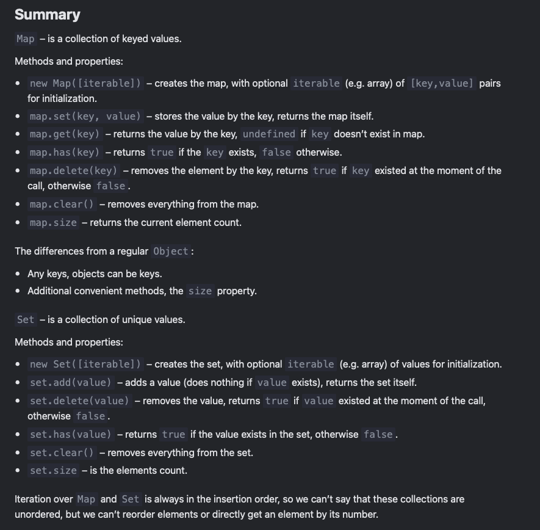

# Map and Set

- Objects are used for storing keyed collections.
- Arrays are used for storing ordered collections.

## Map

- collection of keyed data items where keys can be of any type

Methods and properties are:

- ```new Map()``` – creates the map.
- ```map.set(key, value)``` – stores the value by the key.
- ```map.get(key)``` – returns the value by the key, undefined if key doesn’t exist in map.
- ```map.has(key)``` – returns true if the key exists, false otherwise.
- ```map.delete(key)``` – removes the element (the key/value pair) by the key.
- ```map.clear()``` – removes everything from the map.
- ```map.size``` – returns the current element count.

```js
let map = new Map();

map.set('1', 'str1');   // a string key
map.set(1, 'num1');     // a numeric key
map.set(true, 'bool1'); // a boolean key

// remember the regular Object? it would convert keys to string
// Map keeps the type, so these two are different:
alert( map.get(1)   ); // 'num1'
alert( map.get('1') ); // 'str1'

alert( map.size ); // 3
```

- if we use ```map[key]``` it treats maps like normal JS objects, therefore we use Map methods to utilize map features

### Map can also use objects as keys

```js
let john = { name: "John" };

// for every user, let's store their visits count
let visitsCountMap = new Map();

// john is the key for the map
visitsCountMap.set(john, 123);

alert( visitsCountMap.get(john) ); // 123
```

> How Map compares keys
> To test keys for equivalence, Map uses the algorithm SameValueZero. It is roughly the same as strict equality ===, but the difference is that NaN is considered equal to NaN. So NaN can be used as the key as well.
>
> This algorithm can’t be changed or customized.

- Every map.set call returns the map itself, so we can “chain” the calls:

```js
map.set('1', 'str1')
  .set(1, 'num1')
  .set(true, 'bool1');
```

### Iteration over map

- ```map.keys()``` – returns an iterable for keys,
- ```map.values()``` – returns an iterable for values,
- ```map.entries()``` – returns an iterable for entries ```[key, value]```, it’s used by default in ```for..of```.

```js
let recipeMap = new Map([
  ['cucumber', 500],
  ['tomatoes', 350],
  ['onion',    50]
]);

// iterate over keys (vegetables)
for (let vegetable of recipeMap.keys()) {
  alert(vegetable); // cucumber, tomatoes, onion
}

// iterate over values (amounts)
for (let amount of recipeMap.values()) {
  alert(amount); // 500, 350, 50
}

// iterate over [key, value] entries
for (let entry of recipeMap) { // the same as of recipeMap.entries()
  alert(entry); // cucumber,500 (and so on)
}
```

- The iteration goes in the same order as the values were inserted. Map preserves this order, unlike a regular Object.

```js
//built in forEach method
// runs the function for each (key, value) pair
recipeMap.forEach( (value, key, map) => {
  alert(`${key}: ${value}`); // cucumber: 500 etc
});
```

### Object.entries: map from object

When a Map is created, we can pass an array (or another iterable) with key/value pairs for initialization, like this:

```js
 // array of [key, value] pairs
let map = new Map([
  ['1',  'str1'],
  [1,    'num1'],
  [true, 'bool1']
]);

alert( map.get('1') ); // str1
```

for a map to be created out of plain object we can use built-in method Object.entries(obj) that returns an array of key/value pairs for an object exactly in that format

```js
let obj = {
  name: "John",
  age: 30
};

let map = new Map(Object.entries(obj));

alert( map.get('name') ); // John
```

### Object.fromEntries: object from map

- reverse of Object.entries, given an array of [key, value] pairs, it creates an object from them:

```js
let prices = Object.fromEntries([
  ['banana', 1],
  ['orange', 2],
  ['meat', 4]
]);

// now prices = { banana: 1, orange: 2, meat: 4 }

alert(prices.orange); // 2
```

E.g. we store the data in a Map, but we need to pass it to a 3rd-party code that expects a plain object.

```js
let map = new Map();
map.set('banana', 1);
map.set('orange', 2);
map.set('meat', 4);

let obj = Object.fromEntries(map.entries()); // make a plain object (*)

// done!
// obj = { banana: 1, orange: 2, meat: 4 }

alert(obj.orange); // 2


// making * line shorter:
let obj = Object.fromEntries(map); // omit .entries()
```

That’s the same, because Object.fromEntries expects an iterable object as the argument. Not necessarily an array. And the standard iteration for map returns same key/value pairs as map.entries(). So we get a plain object with same key/values as the map.

## Set

- “set of values” (without keys), where each value may occur only once

- ```new Set([iterable])``` – creates the set, and if an iterable object is provided (usually an array), copies values from it into the set.
- ```set.add(value)``` – adds a value, returns the set itself.
- ```set.delete(value)``` – removes the value, returns true if value existed at the moment of the call, otherwise false.
- ```set.has(value)``` – returns true if the value exists in the set, otherwise false.
- ```set.clear()``` – removes everything from the set.
- ```set.size``` – is the elements count.

```js
let set = new Set();

let john = { name: "John" };
let pete = { name: "Pete" };
let mary = { name: "Mary" };

// visits, some users come multiple times
set.add(john);
set.add(pete);
set.add(mary);
set.add(john);
set.add(mary);

// set keeps only unique values
alert( set.size ); // 3

for (let user of set) {
  alert(user.name); // John (then Pete and Mary)
}
```

## Iteration over set

We can loop over a set either with for..of or using forEach:

```js
 let set = new Set(["oranges", "apples", "bananas"]);

for (let value of set) alert(value);

// the same with forEach:
set.forEach((value, valueAgain, set) => {
  alert(value);
});
```

Note the funny thing. The callback function passed in forEach has 3 arguments: a value, then the same value valueAgain, and then the target object. Indeed, the same value appears in the arguments twice.

That’s for compatibility with Map where the callback passed forEach has three arguments. Looks a bit strange, for sure. But this may help to replace Map with Set in certain cases with ease, and vice versa.

The same methods Map has for iterators are also supported:

- set.keys() – returns an iterable object for values,
- set.values() – same as set.keys(), for compatibility with Map,
- set.entries() – returns an iterable object for entries [value, value], exists for compatibility with Map.


