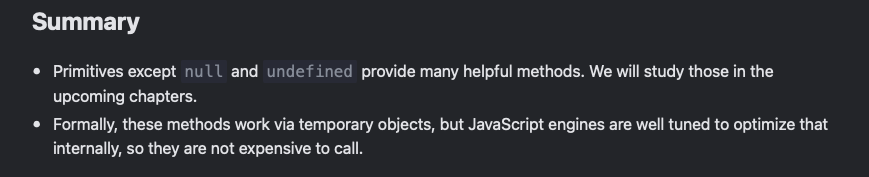

# Methods of primitives

- a primitive is a value of primitive type
- there are 7 primitive types in JavaScript:
  - ```string```
  - ```number```
  - ```boolean```
  - ```null```
  - ```undefined```
  - ```symbol```
  - ```bigint```

- an object

  - is capable of storing multiple values as properties
  - can be created with ```{}```, for instance: ```{name: "John", age: 30}```
  - there are other kinds of objects in JS: functions, for example, are objects.
  - are heavier than primitives and require addtional resources to support internal machinery

the primitives are suppsoed to be as simple and fast as possible and yet be accessible to methods. To achieve this, a special "object wrapper" is created that provides the extra functionality and is then destroyed immediately after the method call.

```javascript
let str = "Hello";

alert( str.toUpperCase() ); // HELLO
```

str.toUpperCase():

1. The string ```str``` is a primitive. So in the moment of accessing its property, a special object is created that knows the value of the string, and has useful methods, like ```toUpperCase()```.
2. That method runs and returns a new string (shown by ```alert```).
3. The special object is destroyed, leaving the primitive ```str``` alone

The JavaScript engine highly optimizes this process. It may even skip the creation of the extra object at all. But it must still adhere to the specification and behave as if it creates one.


