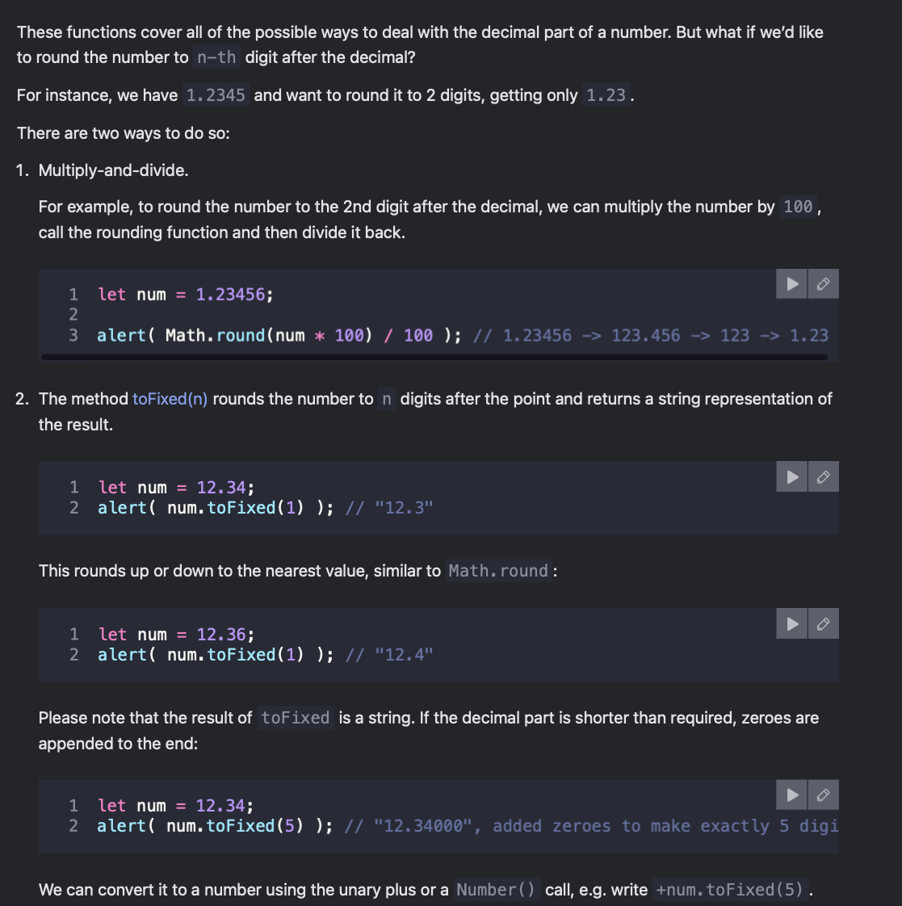
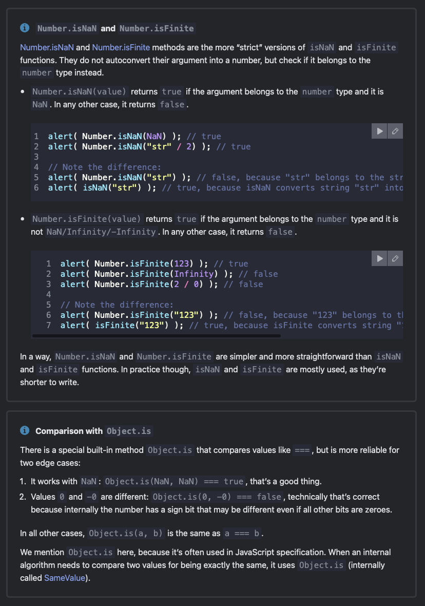

# Numbers

- there are two types of numbers in JS:

- Regular numbers in JavaScript are stored in 64-bit format IEEE-754, also known as “double precision floating point numbers”.

- BigInt numbers represent integers of arbitrary length, needed because a regular integer number can’t safely exceed (2^53-1) or be less than -(2^53-1)

```javascript

let billion = 1000000000;
let billionWithSeparator = 1_000_000_000; // same as above
```

```_``` is playing the role of 'syntactic sugar' here, making it easier to read large numbers
the JS engine ignores the underscores when parsing the number

- the standard method of writing large/small numbers is to use the exponential notation
- just add a ```-``` for small numbers

```javascript
let billion = 1e9; // 1 followed by 9 zeros
let smallNum = 1e-6; // 0.000001
```

## Hex, octal and binary numbers

- hexadecimal numbers can be written in short by using the prefix ```0x```
- same for binary and octal numbers, but with prefixes ```0b``` and ```0o``` respectively

```javascript
let hexNum = 0xFF; // 255 in decimal
let binaryNum = 0b1010; // 10 in decimal
let octalNum = 0o755; // 493 in decimal
```

## toString(base)

- converts a number to a string in the specified base (from 2 to 36)

```javascript
let num = 255;
console.log(num.toString(16)); // "ff" (hexadecimal)
console.log(num.toString(2)); // "11111111" (binary)
console.log(num.toString(8)); // "377" (octal)
```

The base can vary from 2 to 36. By default, it’s 10.

- base=16 is used for hex colors, character encodings etc, digits can be 0..9 or A..F

- base=2 is mostly for debugging bitwise operations, digits can be 0 or 1

- base=36 is the maximum, digits can be 0..9 or A..Z. The whole Latin alphabet is used to represent a number

- useful case for 36 is when we need to turn a long numeric identifier into something shorter, for example, to make a short url. Can simply represent it in the numeral system with base 36:

```javascript
alert( 123456..toString(36) ); // 2n9c
alert( 123456..toString(36).toUpperCase() ); // 2N9C
```

> Two dots to call a method
>
> two dots in 123456..toString(36) is not a typo. If we want to call a method directly on a number, like toString in the example above, then we need to place two dots .. after it.
>
> If we placed a single dot: 123456.toString(36), then there would be an error, because JavaScript syntax implies the decimal part after the first dot. And if we place one more dot, then JavaScript knows that the decimal part is empty and now uses the method.
>
>Also could write (123456).toString(36).

## Rounding

- ```Math.floor```
Rounds down: 3.1 becomes 3, and -1.1 becomes -2.

- ```Math.ceil```
Rounds up: 3.1 becomes 4, and -1.1 becomes -1.

- ```Math.round```
Rounds to the nearest integer: 3.1 becomes 3, 3.6 becomes 4. In the middle cases 3.5 rounds up to 4, and -3.5 rounds up to -3.

- ```Math.trunc``` (not supported by Internet Explorer)
Removes anything after the decimal point without rounding: 3.1 becomes 3, -1.1 becomes -1.



## Imprecise calculations

- of the 64 bits used to store a number
- 52 of them are used to store the digits, 11 of them store the position of the decimal point, and 1 bit is for the sign
- overflow of this 64 bits can lead to imprecise calculations or special numeric values like ```Infinity``` and ```NaN```

```javascript
alert( 0.1 + 0.2 ); // 0.30000000000000004
```

- the error occurs due the the binary representation of the numbers. 0.1 and 0.2 cannot be represented precisely in binary, leading to a small rounding error when they are added together

The numeric format IEEE-754 solves this by rounding to the nearest possible number. These rounding rules normally don’t allow us to see that “tiny precision loss”, but it exists.

We can see this in action:

```javascript
alert( 0.1.toFixed(20) ); // 0.10000000000000000555
```

on adding the “precision losses” add up, that’s why 0.1 + 0.2 is not exactly 0.3

- the most common fix is using ```toFixed(n)``` to round the result but it returns a string, so we need to convert it back to a number:

```javascript
alert( Number((0.1 + 0.2).toFixed(2)) ); // 0.3
```

> // Hello! I'm a self-increasing number!
> alert( 9999999999999999 ); // shows 10000000000000000
> This suffers from the same issue: a loss of precision. There are 64 bits for the number, 52 of them can be used to store digits, but that’s not enough. So the least significant digits disappear.
>
> JavaScript doesn’t trigger an error in such events. It does its best to fit the number into the desired format, but unfortunately, this format is not big enough.
>
> this also leads to the existence of 0 and -0 as one bit is used to store the sign of the number and could be stored as either even for 0, though all operators treat them as equal, except for 1/0 and 1/-0:

```javascript
alert( 1/0 ); // Infinity
alert( 1/-0 ); // -Infinity
```

## Tests isFinite and isNaN

```isNaN(value)``` converts its argument to a number and then tests it for being ```NaN```
```comparison === NaN```?
the value ```NaN``` is unique in that it does not equal anything, including itself:

```javascript
alert( isNaN(NaN) ); // true
alert( isNaN("str") ); // true

alert( NaN === NaN ); // false
```

```isFinite(value)``` converts its argument to a number and returns true if it’s a regular number

```javascript
alert( isFinite("15") ); // true
alert( isFinite("str") ); // false, because a special value: NaN
alert( isFinite(Infinity) ); // false, because a special value: Infinity

// sometimes isFinite is used to validate whether a string value is a regular number
let num = +prompt("Enter a number", '');

// will be true unless you enter Infinity, -Infinity or not a number
alert( isFinite(num) );
```

Please note that an empty or a space-only string is treated as ```0``` in all numeric functions including ```isFinite```



## parseInt and parseFloat

- reads a number from a string until it reaches a character that is not a valid part of a number, then returns the number read

```javascript
alert( parseInt('100px') ); // 100
alert( parseFloat('12.5em') ); // 12.5
alert( parseInt('12.3') ); // 12, only the integer part is returned
alert( parseFloat('12.3.4') ); // 12.3, the second dot is not a valid part of a number, so it stops parsing at that point
alert( parseInt('a123') ); // NaN, the first character is not a valid part of a number, so the parsing fails and returns NaN
```

### The second argument of parseInt(str, radix)

The ```parseInt()``` function has an optional second parameter. It specifies the base of the numeral system, so ```parseInt``` can also parse strings of hex numbers, binary numbers and so on:

```javascript
alert( parseInt('0xff', 16) ); // 255
alert( parseInt('ff', 16) ); // 255, without 0x also works

alert( parseInt('2n9c', 36) ); // 123456
```

## Other math functions

- built-in Math object which contains a small library of mathematical functions and constants

- Math.random()
Returns a random number from 0 to 1 (not including 1).

- Math.max(a, b, c...) and Math.min(a, b, c...)
Returns the greatest and smallest from the arbitrary number of arguments.

- Math.pow(n, power)
Returns n raised to the given power.

```javascript
alert( Math.random() ); // 0.1234567894322
alert( Math.random() ); // 0.5435252343232
alert( Math.random() ); // ... (any random numbers)

alert( Math.max(3, 5, -10, 0, 1) ); // 5
alert( Math.min(1, 2) ); // 1

alert( Math.pow(2, 10) ); // 2 in power 10 = 1024
```
