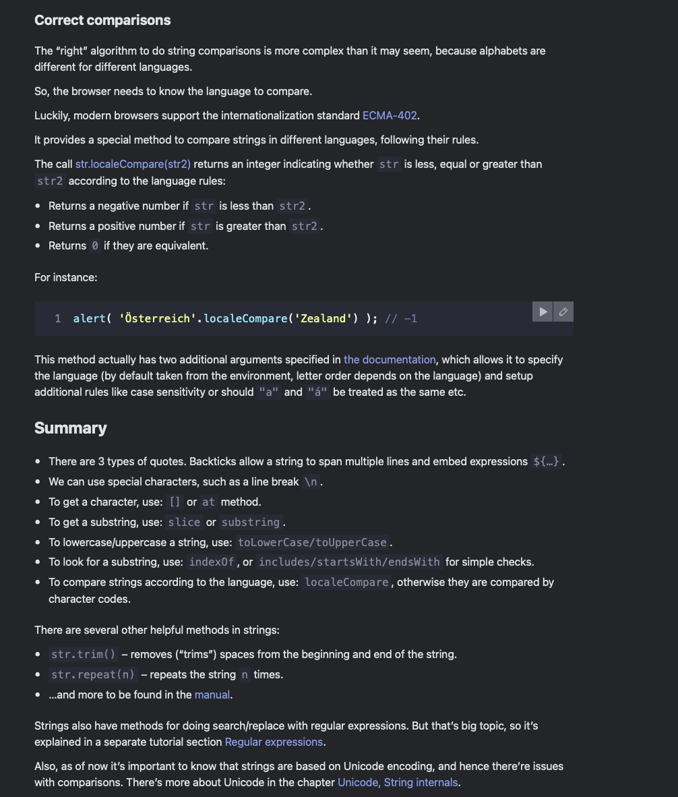

# Strings

- the internal format for strings is always UTF-16, it is not tied to the page encoding

## Quotes

- double and single quotes are boring little things with very limited standard functionality as in most common programming languages

- the backticks however are much more powerful and allow for a wider range of string manipulation and formatting options

- it allows for string interpolation, multi-line strings, and tagged templates

```javascript
function sum(a, b) {
  return a + b;
}

alert(`1 + 2 = ${sum(1, 2)}.`); // 1 + 2 = 3.

let guestList = `Guests:
 * John
 * Pete
 * Mary
`;

alert(guestList); // a list of guests, multiple line
```

## Special characters

- ```\n```, ```\r```, ```\t```, ```\b```, ```\f```, and ```\\``` are the most common special characters
- ```\uXXXX``` is used to represent a Unicode character with the hexadecimal code XXXX

## String length

```javascript
alert( `My\n`.length ); // 3
```

> .length is just a numeric property of the string, not a function, out of habit maybe declared as str.length() which is incorrect.

## Accessing characters

- to get a character at position ```pos```, use square brackets ```[pos]``` or call the method ```str.at(pos)```. 0 indexed.

```javascript
let str = `Hello`;

// the first character
alert( str[0] ); // H
alert( str.at(0) ); // H

// the last character
alert( str[str.length - 1] ); // o
alert( str.at(-1) );

let str = `Hello`;

alert( str[-2] ); // undefined
alert( str.at(-2) ); // l

//using for..of to iterate over characters of the string

for (let char of "Hello") {
  alert(char); // H,e,l,l,o (char becomes "H", then "e", then "l" etc)
}
```

- if pos is negative, its counting goes from the end of the string, so -1 is the last character, -2 is the second to last, and so on.

- if there is no character at the given position, then str[pos] returns undefined, while str.at(pos) returns an empty string.

## Strings are immutable

```javascript
let str = 'Hi';

str[0] = 'h'; // error
alert( str[0] ); // doesn't work

// The usual workaround is to create a whole new string and assign it to str instead of the old one.

let str = 'Hi';

str = 'h' + str[1]; // replace the string

alert( str ); // hi
```

## Changing the case (methods)

```javascript
alert( 'Interface'.toUpperCase() ); // INTERFACE
alert( 'Interface'.toLowerCase() ); // interface

alert( 'Interface'[0].toLowerCase() ); // 'i' //for a single character lowercased
```

## Searching for a substring

### str.indexOf(substr, pos)

- looks for the substr in str, starting from the given position pos, and returns the position where the match was found or -1 if nothing can be found

```javascript
let str = 'Widget with id';

alert( str.indexOf('Widget') ); // 0, because 'Widget' is found at the beginning
alert( str.indexOf('widget') ); // -1, not found, the search is case-sensitive

alert( str.indexOf("id") ); // 1, "id" is found at the position 1 (..idget with id)
alert( str.indexOf("id", 2) ); // 12, looking for "id" from the position 2, so the first word is skipped
```

The optional second parameter allows us to start searching from a given position.

For instance, the first occurrence of "id" is at position 1. To look for the next occurrence, let’s start the search from position 2:

```javascript
 let str = 'Widget with id';

alert( str.indexOf('id', 2) ) // 12
```

If we’re interested in all occurrences, we can run indexOf in a loop. Every new call is made with the position after the previous match:

```javascript
 let str = 'As sly as a fox, as strong as an ox';

let target = 'as'; // let's look for it

let pos = 0;
while (true) {
  let foundPos = str.indexOf(target, pos);
  if (foundPos == -1) break;

  alert( `Found at ${foundPos}` );
  pos = foundPos + 1; // continue the search from the next position
}
```

The same algorithm can be layed out shorter:

```javascript
 let str = "As sly as a fox, as strong as an ox";
let target = "as";

let pos = -1;
while ((pos = str.indexOf(target, pos + 1)) != -1) {
  alert( pos );
}
```

- str.lastIndexOf(substr, position)
  - There is also a similar method str.lastIndexOf(substr, position) that searches from the end of a string to its beginning.

  - It would list the occurrences in the reverse order.

- the indexOf can produce errors with if codeblock as it returns 0 for the first position which is falsy, so it is better to actually check for -1

```javascript
let str = "Widget with id";
if (str.indexOf("Widget") != -1) {
  alert( "Found it!" );
}
```

### includes, startsWith, endsWith

- str.includes(substr, pos) – returns true if the substring substr is found in str at position pos or later
- the other two functions do exactly as their names suggest

```javascript
alert( "Widget with id".includes("Widget") ); // true

alert( "Hello".includes("Bye") ); // false

alert( "Widget".includes("id") ); // true
alert( "Widget".includes("id", 3) ); // false, from position 3 there is no "id"

alert( "Widget".startsWith("Wid") ); // true, "Widget" starts with "Wid"
alert( "Widget".endsWith("get") ); // true, "Widget" ends with "get"
```

## Getting a substring

- 3 methods to get a substring: str.slice(start [, end]), str.substring(start [, end]), and str.substr(start [, length])

### str.slice(start [, end])

- returns the part of the string from start to end (not including end). Both start and end can be negative, in that case position from the end of the string is assumed and with no 2nd argument it goes until the end of the string.

```javascript
let str = "stringify";
alert( str.slice(0, 5) ); // 'strin', the substring from 0 to 5 (not including 5)
alert( str.slice(0, 1) ); // 's', from 0 to 1, but not including 1, so only character at 0

let str = "stringify";
alert( str.slice(2) ); // 'ringify', from the 2nd position till the end

let str = "stringify";

// start at the 4th position from the right, end at the 1st from the right
alert( str.slice(-4, -1) ); // 'gif'
```

### str.substring(start [, end])

- returns the string between start and end (not including end). The difference from slice is that substring allows start to be greater than end, in that case it swaps them
- it does not support negative indexes, they are treated as 0

```javascript
let str = "stringify";

// these are same for substring
alert( str.substring(2, 6) ); // "ring"
alert( str.substring(6, 2) ); // "ring"

// ...but not for slice:
alert( str.slice(2, 6) ); // "ring" (the same)
alert( str.slice(6, 2) ); // "" (an empty string)
```

### str.substr(start [, length])

- returns a substring starting from ```start``` of the given ```length```
- the first argument may be negative, then it counts from the end of the string, if the second argument is negative, it is treated as 0

```javascript
let str = "stringify";
alert( str.substr(2, 4) ); // 'ring', from the 2nd position get 4 characters

let str = "stringify";
alert( str.substr(-4, 2) ); // 'gi', from the 4th position get 2 characters
```

## Comparing strings

- strings are compared letter by letter in the lexicographical order
- the comparison is case-sensitive, so "a" < "A" < "B" < "b"

```javascript
alert( 'a' > 'Z' ); // true
alert( 'Österreich' > 'Zealand' ); // true
```

- since the strings in JS are encoded in UTF-16, the comparison is based on the Unicode code points of the characters

- str.codePointAt(pos)
  - returns the code of the character at position pos

- string.fromCodePoint(code)
  - does the opposite, creates a string character by its code

```javascript
// different case letters have different codes
alert( "Z".codePointAt(0) ); // 90
alert( "z".codePointAt(0) ); // 122
alert( "z".codePointAt(0).toString(16) ); // 7a (if we need a hexadecimal value)

alert( String.fromCodePoint(90) ); // Z
alert( String.fromCodePoint(0x5a) ); // Z (we can also use a hex value as an argument)

let str = '';

for (let i = 65; i <= 220; i++) {
  str += String.fromCodePoint(i);
}
alert( str );
// Output:
// ABCDEFGHIJKLMNOPQRSTUVWXYZ[\]^_`abcdefghijklmnopqrstuvwxyz{|}~€‚ƒ„
// ¡¢£¤¥¦§¨©ª«¬­®¯°±²³´µ¶·¸¹º»¼½¾¿ÀÁÂÃÄÅÆÇÈÉÊËÌÍÎÏÐÑÒÓÔÕÖ×ØÙÚÛÜ
```


