# Javascript by [javascript.info](https://javascript.info/) notes

## Objects - the basics

### Objects

- used to store keyed collections of various data and more complex entities

created with curly braces ```{…}``` with an optional list of properties. A property is a “key: value” pair, where ```key``` is a string (also called a “property name”), and ```value``` can be anything.

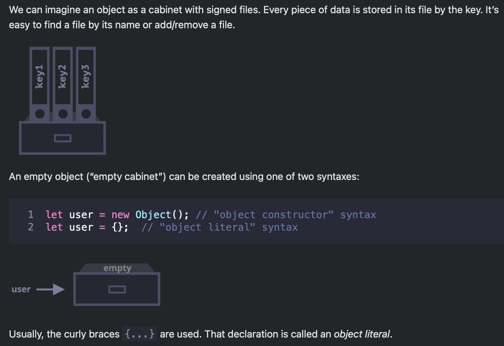

#### Literals and properties

```javascript
let user = {     // an object
  name: "John",  // by key "name" store value "John"
  age: 30        // by key "age" store value 30
};

// get property values of the object:
alert( user.name ); // John
alert( user.age ); // 30

user.isAdmin = true;

// to remove a property, we can use the delete operator:

delete user.age;

// we can also use multiword property names, but then they must be quoted:

let user = {
  ...,
  "likes birds": true  // multiword property name must be quoted
};

// the last property in the list may end with a comma:

let user = {
  name: "John",
  age: 30,
}

That is called a “trailing” or “hanging” comma. Makes it easier to add/remove/move around properties, because all lines become alike.

```

#### Square brackets

```javascript
// this would give a syntax error
user.likes birds = true

// javaScript doesn’t understand that. It thinks that we address user.likes, and then gives a syntax error when comes across unexpected birds.

// the dot requires the key to be a valid variable identifier. That implies: contains no spaces, doesn’t start with a digit and doesn’t include special characters ($ and _ are allowed).

// there’s an alternative “square bracket notation” that works with any string:

 let user = {};

// set
user["likes birds"] = true;

// get
alert(user["likes birds"]); // true

// delete
delete user["likes birds"];
```

- square brackets also provide a way to obtain the property name as the result of any expression – as opposed to a literal string – like from a variable as follows:

```javascript
let key = "likes birds";

// same as user["likes birds"] = true;
user[key] = true;
```

- the variable key may be calculated at run-time or depend on the user input. And then we use it to access the property.

for instance:

```javascript
 let user = {
  name: "John",
  age: 30
};

let key = prompt("What do you want to know about the user?", "name");

// access by variable
alert( user[key] ); // John (if enter "name")

// the dot notation cannot be used in a similar way:

 let user = {
  name: "John",
  age: 30
};

let key = "name";
alert( user.key ) // undefined
```

Why ```user[key]``` works

When you use square brackets without quotes, JavaScript evaluates what is inside the brackets first. It looks at the variable ```key```, sees that it holds the value ```"name"```, and swaps it out.

```javascript
alert(user[key]); //  "John"
```

- user[key] is translated into user["name"].

#### Computed properties

using square brackets in an object literal, when creating an object is called computed properties.

For instance:

```javascript
let fruit = prompt("Which fruit to buy?", "apple");

let bag = {
  [fruit]: 5, // the name of the property is taken from the variable fruit
};

alert( bag.apple ); // 5 if fruit="apple"
```

The meaning of a computed property is simple: ```[fruit]``` means that the property name should be taken from ```fruit```.

So, if a visitor enters ````"apple"````, ````bag```` will become ````{apple: 5}````.

Essentially, that works the same as:

```javascript
let fruit = prompt("Which fruit to buy?", "apple");
let bag = {};

// take property name from the fruit variable
bag[fruit] = 5;
```

We can use more complex expressions inside square brackets:

```javascript
let fruit = 'apple';
let bag = {
  [fruit + 'Computers']: 5 // bag.appleComputers = 5
};
```

#### Property value shorthands

When the property name is the same as the variable name, we can just write it once.

```javascript
function makeUser(name, age) {
  return {
    name: name,
    age: age,
    // ...other properties
  };
}

let user = makeUser("John", 30);
alert(user.name); // John

// in the example above, properties have the same names as variables. The use-case of making a property from a variable is so common, that there’s a special property value shorthand to make it shorter.

// instead of name:name we can just write name, like this:

function makeUser(name, age) {
  return {
    name, // same as name: name
    age,  // same as age: age
    // ...
  };
}

// we can use both normal properties and shorthands in the same object:

let user = {
  name,  // same as name:name
  age: 30
};
```

- unlike variables which can't take names like for, let, return, etc.

- there are no limitations on property names, can be any strings or symbols (a special type for identifiers, to be covered later).

- other types are automatically converted to strings.

- for instance, a number 0 becomes a string "0" when used as a property key

> a special property named __proto__ can’t be set to a non-object value:

```javascript
let obj = {};
obj.__proto__ = 5; // assign a number
alert(obj.__proto__); // [object Object] - the value is an object, didn't work as intended
```

- the assignment to a primitive 5 is ignored.

#### Property existence test, “in” operator

- in javascript, it's possible to access any properties no matter if it exists or not, if the property doesn't exist, it will return undefined.

```javascript
let user = {};

alert( user.noSuchProperty === undefined ); // true means "no such property"

// there’s also a special operator "in" for that
"key" in object

let user = { name: "John", age: 30 };

alert( "age" in user ); // true, user.age exists
alert( "blabla" in user ); // false, user.blabla doesn't exist
```

- the left side of ```in``` must be a property name and quoted string
- if we omit quotes then variable should contain the actual name to be tested

```javascript
let user = { age: 30 };

let key = "age";
alert( key in user ); // true, property "age" exists
```

- the ```in``` operator exists for the one special case when comparing against undefined fails, that is when the object property exists but stores the value undefined.

```javascript
let obj = {
  test: undefined
};

alert( obj.test ); // it's undefined, so - no such property?

alert( "test" in obj ); // true, the property does exist!
```

### For..in loop

- to walk over all keys of an object

```javascript
for (key in object) {
  // executes the body for each key among object properties
}

//for instance:

let user = {
  name: "John",
  age: 30,
  isAdmin: true
};

for (let key in user) {
  // keys
  alert( key );  // name, age, isAdmin
  // values for the keys
  alert( user[key] ); // John, 30, true
}
```

- the order of keys is not guaranteed, so don’t rely on it. In practice, modern engines enumerate object keys in the same order as they were added, but that’s not something we should rely on.
- we could use another variable name here instead of key. For instance, "for (let prop in obj)" is also widely used.

#### Ordered like an object

- integer properties are sorted, while string properties are listed in creation order.
- integer properties are those that can be converted to and from a 32-bit non-negative integer (0, 1, 2, etc.) without a change

```javascript
// explicitly converts to a number
// Math.trunc is a built-in function that removes the decimal part
alert( String(Math.trunc(Number("49"))) ); // "49", same, integer property
alert( String(Math.trunc(Number("+49"))) ); // "49", not same "+49" ⇒ not integer property
alert( String(Math.trunc(Number("1.2"))) ); // "1", not same "1.2" ⇒ not integer property
```

- integers are always sorted in ascending order

- string properties are listed in the order they were created.

for the integer values to also show up in order, we can add a non-integer property before them:

```javascript
let codes = {
  "+49": "Germany",
  "+41": "Switzerland",
  "+44": "Great Britain",
  // ..,
  "+1": "USA"
};

for (let code in codes) {
  alert( +code ); // 49, 41, 44, 1
}
```

## Object references and copying

- objects are stored and copied “by reference” unlike primitive values that are copied by their value

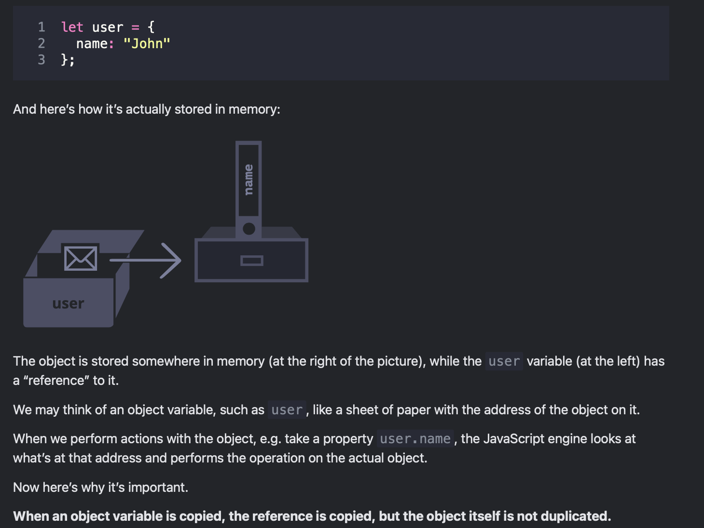

- when an object variable is copied, the reference is copied, but the object itself is not duplicated

there’s still one object, but now with two variables that reference it.
either variable can be used to access the object and modify its contents:

```javascript
let user = { name: 'John' };

let admin = user;

admin.name = 'Pete'; // changed by the "admin" reference

alert(user.name); // 'Pete', changes are seen from the "user" reference
```

It’s as if we had a cabinet with two keys and used one of them (admin) to get into it and make changes. Then, if we later use another key (user), we are still opening the same cabinet and can access the changed contents.

- two variables are equal if they reference the same object, even with strict equality ===

- two variables that reference different objects are not equal, even if those objects look the same

>[!NOTE]
>
>Const objects can be modified
>An important side effect of storing objects as references is that an object declared as const can be modified.
>
>For instance:
>

```javascript
const user = {
 name: "John"
};

user.name = "Pete"; // (*)

alert(user.name); // Pete
```

>It might seem that the line (*) would cause an error, but it does not. The value of user
>is constant, it must always reference the same object, but properties of that object are
>free to change.
>
>In other words, the const user gives an error only if we try to set user=... as a whole.
>
>That said, if we really need to make constant object properties, it’s also possible, but using totally different methods. We’ll mention that in the chapter Property flags and descriptors.

### Cloning and merging, Object.assign

- for cloning an object, intuitively we would loop and store the key value pairs

```javascript
let user = {
  name: "John",
  age: 30,
}

let clone = {};

for (let prop in user){
  clone[prop] = user[prop];
}
```

- or we can use Object.assign for that

```javascript
Object.assign(dest, ...sources)
```

1. The first argument dest is a target object.
2. Further arguments is a list of source objects.
3. It copies the properties of all source objects into the target dest, and then returns it as the result.

```javascript
et user = { name: "John" };

let permissions1 = { canView: true };
let permissions2 = { canEdit: true };

// copies all properties from permissions1 and permissions2 into user
Object.assign(user, permissions1, permissions2);

// now user = { name: "John", canView: true, canEdit: true }
```

- If the copied property name already exists, it gets overwritten:

```javascript
let user = { name: "John" };

Object.assign(user, { name: "Pete" });

// now user = { name: "Pete" }
```

- something about spread syntax, we'll do that later it says

#### Nested cloning

- until now we assumed that objects were primitive but they can also be a reference to another object

- in this case, cloning an object would create a reference to the same inner object, which means if we decide to change a value only in the clone object, it will also change the original object

```javascript
let user = {
  name: "John",
  sizes: {
    height: 182,
    width: 50
  }
};

let clone = Object.assign({}, user);

alert( user.sizes === clone.sizes ); // true, same object

// user and clone share sizes
user.sizes.width = 60;    // change a property from one place
alert(clone.sizes.width); // 60, get the result from the other one
```

- to fix that, we use a deep clone or structured cloning algorithm, that examines each value of ```user[key]``` and, if it’s an object, then replicate its structure as well

#### Structured cloning

- the call structuredClone(object) clones the object with all nested properties.

```javascript
let user = {
  name: "John",
  sizes: {
    height: 182,
    width: 50
  }
};

let clone = structuredClone(user);

alert( user.sizes === clone.sizes ); // false, different objects

// user and clone are totally unrelated now
user.sizes.width = 60;    // change a property from one place
alert(clone.sizes.width); // 50, not related
```

- the structuredClone method can clone most data types, such as objects, arrays, primitive values.

- it also supports circular references, when an object property references the object itself (directly or via a chain or references).

For instance:

```javascript
let user = {};
// let's create a circular reference:
// user.me references the user itself
user.me = user;

let clone = structuredClone(user);
alert(clone.me === clone); // true
```

BUT WHY WOULD YOU DO THAT

- structuredClone fails when the object contains functions, DOM nodes, and some other special objects. In that case, it throws an error
- to get around these, we can use a method ```_.cloneDeep(obj)``` from the lodash library

## Garbage collection

- memory management is automatic in JavaScript. Memory is allocated when objects are created and freed when they are not needed anymore. The process of freeing memory is called garbage collection.

### Reachability

- reachability is the main concept of memory management in JS

- “reachable” values are those that are accessible or usable somehow

- There’s a base set of inherently reachable values, that cannot be deleted for obvious reasons.
  for instance:

  - The currently executing function, its local variables and parameters.
  - Other functions on the current chain of nested calls, their local variables and parameters.
  - Global variables.

// (there are some other, internal ones as well)

These values are called roots.

Any other value is considered reachable if it’s reachable from a root by a reference or   by a chain of references.

For instance, if there’s an object in a global variable, and that object has a property referencing another object, that object is considered reachable. And those that it references are also reachable. Detailed examples to follow.

- there’s a background process in the JS engine that is called garbage collector. It monitors all objects and removes those that have become unreachable.

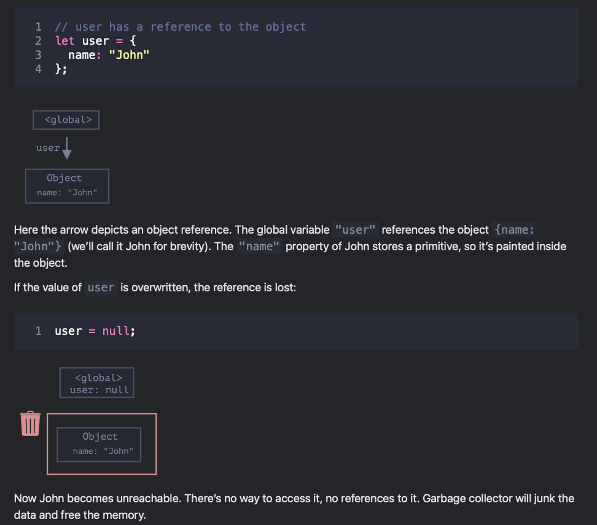

- if instead the object was referenced by two variables and one was set to ```null```, then the object would still have been reachable and thus not removed by the garbage collector

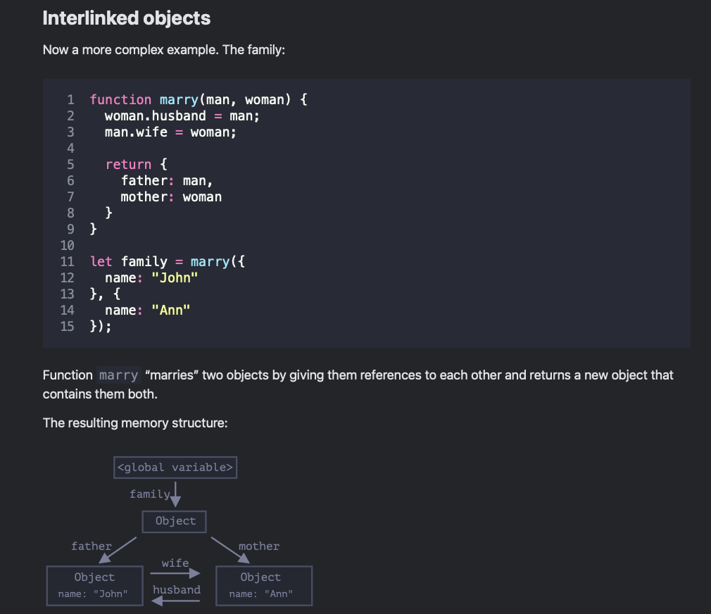

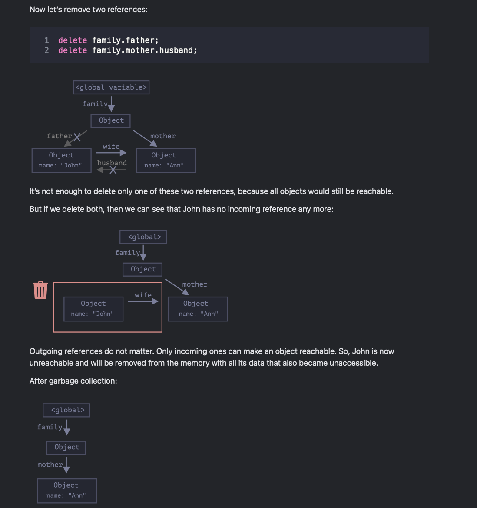

#### Unreachable islands

- it is possible that the whole island of interlinked objects becomes unreachable and is removed from the memory.

- the source object is the same as above. Then:

```javascript
family = null;
```

- John and Ann are still linked, both have incoming references

- the former "family" object has been unlinked from the root, there’s no reference to it any more, so the whole island becomes unreachable and will be removed.

### Internal algorithms

- the basic garbage collectoin algorithm is called mark-and-sweep

- the garbage collector takes roots and “marks” (remembers) them.
- then it visits and “marks” all references from them.
- then it visits marked objects and marks their references. All visited objects are remembered, so as not to visit the same object twice in the future.
- …and so on until every reachable (from the roots) references are visited.
- all objects except marked ones are removed.

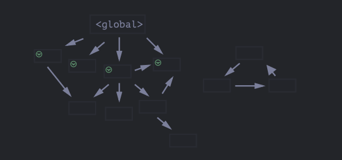
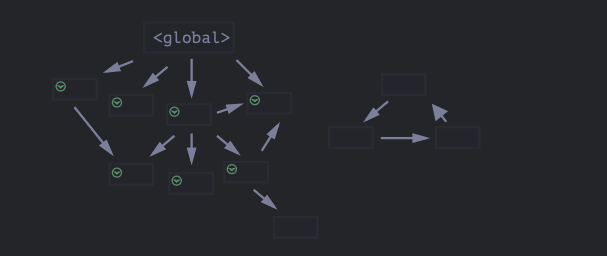

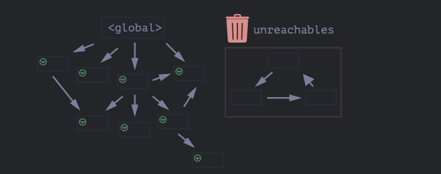

- Javascript engines run a lot of optimizations to make the garbage collection process more efficient

Some of the optimizations:

- __Generational collection__ – objects are split into two sets: “new ones” and “old ones”. In typical code, many objects have a short life span: they appear, do their job and die fast, so it makes sense to track new objects and clear the memory from them if that’s the case. Those that survive for long enough, become “old” and are examined less often.

- __Incremental collection__ – if there are many objects, and we try to walk and mark the whole object set at once, it may take some time and introduce visible delays in the execution. So the engine splits the whole set of existing objects into multiple parts. And then clear these parts one after another. There are many small garbage collections instead of a total one. That requires some extra bookkeeping between them to track changes, but we get many tiny delays instead of a big one.

- __Idle-time collection__ – the garbage collector tries to run only while the CPU is idle, to reduce the possible effect on the execution.

>[!IMPORTANT]
>
> I'M NOT SURE WHAT LINTER I'M USING BUT THIS FUCKASS LINTER THINKS ITS MORE STANDARD TO USE
> UNDERSCORES FOR STRONG STYLE THAN ASTERISKS

## Object methods, "this"

- actions are represented in JavaScript by functions in properties.

### method examples

```javascript
let user = {
  name: "John",
  age: 30
};

user.sayHi = function() {
  alert("Hello!");
};

user.sayHi(); // Hello!
```

- a function that is a property of an object is called its method.

- to use a pre-declared function as a method

```javascript
let user = {
  // ...
};

// first, declare
function sayHi() {
  alert("Hello!");
}

// then add as a method
user.sayHi = sayHi;

user.sayHi(); // Hello!
```

- since we are writing our code using objects to represent entities, this is OOP, object oriented programming

### method shorthand

- we can omit using the function keyword when declaring a method in an object literal:

```javascript

// these objects do the same

user = {
  sayHi: function() {
    alert("Hello");
  }
};

// method shorthand looks better, right?
user = {
  sayHi() { // same as "sayHi: function(){...}"
    alert("Hello");
  }
};
```

- there are subtle differences between the two syntaxes related to object inheritance but almost always the method shorthand is used in practice

### "this" in methods

- to access the object, a method can use the ```this``` keyword

```javascript
let user = {
  name: "John",
  age: 30,

  sayHi() {
    // "this" is the "current object"
    alert(this.name);
  }

};

user.sayHi(); // John
```

instead of ```this.name``` we could also write ```user.name```, but that would be less flexible. If we assign user to another variable, then ```user.name``` would not work anymore, while ```this.name``` would still work.

### "this" is not bound

- the value of ```this``` is evaluated based on context and can be used in any function

```javascript
let user = { name: "John" };
let admin = { name: "Admin" };

function sayHi() {
  alert( this.name );
}

// use the same function in two objects
user.f = sayHi;
admin.f = sayHi;

// these calls have different this
// "this" inside the function is the object "before the dot"
user.f(); // John  (this == user)
admin.f(); // Admin  (this == admin)

admin['f'](); // Admin (dot or square brackets access the method – doesn't matter)
```

[!NOTE]
>
> Calling without an object: this == undefined
> We can even call the function without an object at all:

```javascript
 function sayHi() {
  alert(this);
}
```

> sayHi(); // undefined
> In this case this is undefined in strict mode. If we try to access this.name, there will be an error.
>
> In non-strict mode the value of this in such case will be the global object (window in a browser, we’ll get to it later in the chapter Global object). This is a historical behavior that "use strict" fixes.
>
> Usually such call is a programming error. If there’s this inside a function, it expects to be called in an object context.

### arrow functions have no "this"

- arrow functions don't have their own this, if ```this``` is referenced then it's is taken from the outer normal function

```javascript
let user = {
  firstName: "Ilya",
  sayHi() {
    let arrow = () => alert(this.firstName);
    arrow();
  }
};

user.sayHi(); // Ilya
```

### summary

1. Functions that are stored in object properties are called “methods”.
2. Methods allow objects to “act” like ```object.doSomething()```.
3. Methods can reference the object as ```this```.
4. The value of ```this``` is defined at run-time.
5. When a function is declared, it may use ```this```, but that ```this``` has no value until the function is called.
6. A function can be copied between objects.
7. When a function is called in the “method” syntax: ```object.method()```, the value of ```this``` during the call is ```object```.

## Constructor, operator "new"

- when we need to create many objects of the same type, we can use a constructor function and the new operator

- constructor functions technically are regular functions. There are two conventions though:

1. They are named with capital letter first.
2. They should be executed only with ```"new"``` operator.

```javascript
function User(name) {
  this.name = name;
  this.isAdmin = false;
}

let user = new User("Jack");

alert(user.name); // Jack
alert(user.isAdmin); // false
```

When a function is executed with new, it does the following steps:

1. A new empty object is created and assigned to this.
2. The function body executes. Usually it modifies this, adds new properties to it.
3. The value of this is returned.

In other words, ```new User(...)``` does something like:

```javascript
function User(name) {
  // this = {};  (implicitly)

  // add properties to this
  this.name = name;
  this.isAdmin = false;

  // return this;  (implicitly)
}
// So let user = new User("Jack") gives the same result as:

let user = {
  name: "Jack",
  isAdmin: false
};
```

- to create other users now, we can just call ```new User("Ann"), new User("Alice")```

- this being the main purpose of constructors, to implement reusable object creation code

- any function except arrow functions can be used as a constructor, as arrow functions do not have ```this```

- in case we have a multiline code block for creating a single complex object, it can be wrapped in an immediately called constructor function, like this:

```javascript
// create a function and immediately call it with new
let user = new function() {
  this.name = "John";
  this.isAdmin = false;

  // ...other code for user creation
  // maybe complex logic and statements
  // local variables etc
};
```

### Constructor mode test: new.target

> __ADVANCE TOPIC, RARELY USED__

- we can check if a function is called with new by using the new.target property

```javascript
function User() {
  alert(new.target);
}

// without "new":
User(); // undefined

// with "new":
new User(); // function User { ... }
<------------------------------------------------------>

function User(name) {
  if (!new.target) { // if you run me without new
    return new User(name); // ...I will add new for you
  }

  this.name = name;
}

let john = User("John"); // redirects call to new User
alert(john.name); // John
```

- This approach is sometimes used in libraries to make the syntax more flexible. So that people may call the function with or without ```new```, and it still works.

- not a good thing to use everywhere though, because omitting new makes it less obvious what’s going on. With ```new``` we all know that the new object is being created.

### Return from constructors

- rare edge case in Js

This screenshot covers a specific, rare edge case in JavaScript regarding __Constructor Functions__ (functions called with the `new` keyword).

To understand this, we first need to remember how a constructor normally works, and then see how an explicit `return` statement completely hijacks that behavior.

---

The Normal Behavior (No `return`)

Normally, when you use the `new` keyword with a function, JavaScript automatically does three things behind the scenes:

1. It creates a brand-new empty object and assigns it to `this`.
2. It runs your code (like `this.name = "John"`), adding properties to that new object.
3. __It automatically returns that `this` object at the end.__ You don't have to type `return`.

---

The Exception: What happens if you add a `return`?

If you force a `return` statement inside a constructor, JavaScript follows a very strict "override" rule based on __what__ you are returning:

1. __If you return an OBJECT:__ The constructor completely throws away `this` and returns your object instead.
2. __If you return a PRIMITIVE (or empty `return`):__ The constructor completely ignores your return statement and returns `this` anyway.

Let's look at the two examples from your screenshot to see this rule in action.

---

### Example 1: Returning an Object (The Hijack)

```javascript
function BigUser() {
  this.name = "John"; // 1. This happens...
  return { name: "Godzilla" }; // 2. But then this overrides it!
}

alert( new BigUser().name ); // ➔ "Godzilla"

```

- __What's happening:__ JavaScript starts building an object with the name `"John"`.
- __The Twist:__ On line 4, it hits `return { name: "Godzilla" };`. Because `{ name: "Godzilla" }` is an __object__, JavaScript essentially says: *"Okay, change of plans! Throw away the 'John' object we were building, and output this 'Godzilla' object instead."*

---

### Example 2: Returning an Empty/Primitive Value (The Ignore)

```javascript
function SmallUser() {
  this.name = "John";
  return; // ➔ Ignored! (or returning a primitive like 5, "hello", true)
}

alert( new SmallUser().name ); // ➔ "John"
```

- __What's happening:__ JavaScript builds the object with the name `"John"`.
- __The Twist:__ It hits an empty `return;` (which is technically returning `undefined`). Because `undefined` is a __primitive__ (not an object), JavaScript completely ignores it. It proceeds with its default behavior and returns the original `this` object containing `"John"`.

---

__Summary Table:__

| If the constructor returns... | What actually gets outputted by `new`? |
| --- | --- |
| __An Object__ (e.g., `{...}`, `[]`, `function()`) | __The returned object__ (`this` is entirely ignored). |
| __A Primitive__ (e.g., `string`, `number`, `boolean`, `undefined`) | __The `this` object__ (the return statement is completely ignored). |

> __Note:__ As the text mentions at the bottom, you will almost *never* write a `return` statement inside a constructor function in real-world programming. It's bad practice because it confuses other developers. JavaScript just has this rule for the sake of completeness!

- parenthesis after ```new``` can be ignored if there are no arguments

```javascript
let user = new User; // <-- no parentheses
// same as
let user = new User();
```

## Methods in constructor functions

```new User(name)``` below creates an object with the given ```name``` and the method ```sayHi```:

```javascript
function User(name) {
  this.name = name;

  this.sayHi = function() {
    alert( "My name is: " + this.name );
  };
}

let john = new User("John");

john.sayHi(); // My name is: John

/*
john = {
   name: "John",
   sayHi: function() { ... }
}
*/
```

## Optional chaining "?."

- recent addition to the language, old browsers may need a polyfill

- a safe way to access nested object properties, even if an intermediate property doesn’t exist.

let’s say we have ```user``` objects that hold the information about our users.

Most of our users have addresses in ```user.address``` property, with the street ```user.address.street```, but some did not provide them.

In such case, when we attempt to get ```user.address.street```, and the user happens to be without an address, we get an error:

```javascript
let user = {}; // a user without "address" property

alert(user.address.street); // Error!
```

- that is because the way Js works, it first evaluates ```user.address```, and since it’s undefined, it can’t read the property street of undefined, and throws an error

- In Web development, we can get an object that corresponds to a web page element using a special method call, such as ```document.querySelector('.elem')```, and it returns null when there’s no such element.

```javascript
// document.querySelector('.elem') is null if there's no element
let html = document.querySelector('.elem').innerHTML; // error if it's null
```

Once again, if the element doesn’t exist, we’ll get an error accessing ```.innerHTML``` property of ```null```. And in some cases, when the absence of the element is normal, we’d like to avoid the error and just accept ```html = null``` as the result.

- the obvious solution to this could be using the if statement to check if the element exists before accessing its property but that tends to add a lot of extra code and nesting, code repetition

```javascript
let user = {};

alert(user.address ? user.address.street : undefined);
<------------------------------------------------------>
let html = document.querySelector('.elem') ? document.querySelector('.elem').innerHTML : null;

// a little better way to execute this could be using &&

let user = {}; // user has no address

alert( user.address && user.address.street && user.address.street.name ); // undefined (no error)
```

### Optional chaining

- ```?.``` operator stops the evalutation if the value before it is undefined or null and returns undefined

In other words, ```value?.prop```:

- works as ```value.prop```, if value exists,
- otherwise (when value is undefined/null) it returns undefined

```javascript
let user = {}; // user has no address

alert( user?.address?.street ); // undefined (no error)

<------------------------------------------------------>

let html = document.querySelector('.elem')?.innerHTML; // will be undefined, if there's no element


// Reading the address with user?.address works even if user object doesn’t exist:

let user = null;

alert( user?.address ); // undefined
alert( user?.address.street ); // undefined
```

>[!IMPORTANT]
>
> Please note: the ?. syntax makes optional the value before it, but not any further.
>
> E.g. in user?.address.street.name the ?. allows user to safely be null/undefined (and returns undefined in that case), but that’s only for user. Further properties are accessed in a regular way. If we want some of them to be optional, then we’ll need to replace more . with ?..
>
> <------------------------------------------------------>
>
> Don’t overuse the optional chaining
> We should use ?. only where it’s ok that something doesn’t exist.
>
> For example, if according to our code logic user object must exist, but address is optional, then we should write user.address?.street, but not user?.address?.street.
>
> Then, if user happens to be undefined, we’ll see a programming error about it and fix it. Otherwise, if we overuse ?., coding errors can be silenced where not appropriate, and become more difficult to debug.
>
> <------------------------------------------------------>
>
> The variable before ?. must be declared
> If there’s no variable user at all, then user?.anything triggers an error:
>
> // ReferenceError: user is not defined
> user?.address;
> The variable must be declared (e.g. let/const/var user or as a function parameter). The optional chaining works only for declared variables.

### Short circuiting

- the ?. immediately stops __(“short-circuits”)__ the evaluation if the left part doesn’t exist.

#### Other variants: ?.() and ?.[]

- ?. is not an operator, but a special syntax construct, that also works with functions and square brackets

- eg. ?.() could be used to call a function that may not exist

```javascript
let userAdmin = {
  admin() {
    alert("I am admin");
  }
};

let userGuest = {};

userAdmin.admin?.(); // I am admin

userGuest.admin?.(); // nothing happens (no such method)
```

Here, in both lines we first use the dot (userAdmin.admin) to get admin property, because we assume that the user object exists, so it’s safe read from it.

Then ?.() checks the left part: if the admin function exists, then it runs (that’s so for userAdmin). Otherwise (for userGuest) the evaluation stops without errors.

- The ?.[] syntax also works, if we’d like to use brackets [] to access properties instead of dot .. Similar to previous cases, it allows to safely read a property from an object that may not exist.

```javascript
let key = "firstName";

let user1 = {
  firstName: "John"
};

let user2 = null;

alert( user1?.[key] ); // John
alert( user2?.[key] ); // undefined
```

Also we can use ?. with delete:

```javascript
delete user?.name; // delete user.name if user exists
```

>[!NOTE]
>
> We can use ?. for safe reading and deleting, but not writing
> The optional chaining ?. has no use on the left side of an assignment.
>
> For example:
>
> let user = null;
>
> user?.name = "John"; // Error, doesn't work
> // because it evaluates to: undefined = "John"

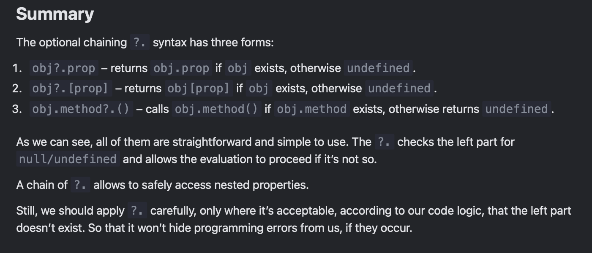

## Symbol type

By specification, only two primitive types may serve as object property keys:

- string type, or
- symbol type

Otherwise, if one uses another type, such as number, it’s autoconverted to string. So that obj[1] is the same as obj["1"], and obj[true] is the same as obj["true"].

### Symbols

- represents a unique identifier
- created using the ```Symbol()``` function

- we can give symbols a description (also called a symbol name), mostly useful for debugging purposes

```javascript
// id is a symbol with the description "id"
let id = Symbol("id");
```

- symbols are unique, even if they have the same description, they are different values. The description is just a label that doesn't affect anything.

```javascript
let id1 = Symbol("id");
let id2 = Symbol("id");

alert(id1 == id2); // false
```

>[!NOTE]
>
> Symbols don’t auto-convert to a string
> Most values in JavaScript support implicit conversion to a string. For instance, we can alert almost any value, and it will work. Symbols are special. They don’t auto-convert.
>
> For instance, this alert will show an error:

```javascript
 let id = Symbol("id");
alert(id); // TypeError: Cannot convert a Symbol value to a string

// That’s a “language guard” against messing up, because strings and symbols are fundamentally different and should not accidentally convert one into another.

// If we really want to show a symbol, we need to explicitly call .toString() on it, like here:

 let id = Symbol("id");
alert(id.toString()); // Symbol(id), now it works

// Or get symbol.description property to show the description only:

 let id = Symbol("id");
alert(id.description); // id
```

### Hidden properties

- Symbols allow us to create “hidden” properties of an object, that no other part of code can accidentally access or overwrite.

```javascript
let user = { // belongs to another code
  name: "John"
};

let id = Symbol("id");

user[id] = 1;

alert( user[id] ); // we can access the data using the symbol as the key
alert( user["id"] ); // undefined, the "id" property is not created
```

> What’s the benefit of using Symbol("id") over a string "id"?

As ```user``` objects belong to another codebase, it’s unsafe to add fields to them, since we might affect pre-defined behavior in that other codebase. However, symbols cannot be accessed accidentally. The third-party code won’t be aware of newly defined symbols, so it’s safe to add symbols to the ```user``` objects.

Also, imagine that another script wants to have its own identifier inside ```user```, for its own purposes.

Then that script can create its own ```Symbol("id")```, like this:

```javascript
// ...
let id = Symbol("id");

user[id] = "Their id value";
```

There will be no conflict between our and their identifiers, because symbols are always different, even if they have the same name.

…But if we used a string ```"id"``` instead of a symbol for the same purpose, then there would be a conflict:

```javascript
let user = { name: "John" };

// Our script uses "id" property
user.id = "Our id value";

// ...Another script also wants "id" for its purposes...

user.id = "Their id value"
// Boom! overwritten by another script!
```

#### Symbols in an object literal

- to use a symbol in an object literal ```{...}```, we need square brackets around it

```javascript
let id = Symbol("id");

let user = {
  name: "John",
  [id]: 123 // not "id": 123
};
```

#### Symbols are skipped by for..in

- symbolic properties do not participate in for..in loops, they are skipped

```javascript
let id = Symbol("id");
let user = {
  name: "John",
  age: 30,
  [id]: 123
};

for (let key in user) alert(key); // name, age (no symbols)

// the direct access by the symbol works
alert( "Direct: " + user[id] ); // Direct: 123
```

```Object.keys(user)``` also ignores them. That’s a part of the general “hiding symbolic properties” principle. If another script or a library loops over our object, it won’t unexpectedly access a symbolic property.

In contrast, ```Object.assign``` copies both string and symbol properties:

```javascript
let id = Symbol("id");
let user = {
  [id]: 123
};

let clone = Object.assign({}, user);

alert( clone[id] ); // 123
```

There’s no paradox here. That’s by design. The idea is that when we clone an object or merge objects, we usually want all properties to be copied (including symbols like id).

### Global symbols

- same entity-type symbols that are used in the code to represent the same property can be stored in a global symbol registry, it guarantees that repeated accesses by the same name return exactly the same symbol

In order to read (create if absent) a symbol from the registry, use ```Symbol.for(key)```.

That call checks the global registry, and if there’s a symbol described as ```key```, then returns it, otherwise creates a new symbol ```Symbol(key)``` and stores it in the registry by the given ```key```.

```javascript
// read from the global registry
let id = Symbol.for("id"); // if the symbol did not exist, it is created

// read it again (maybe from another part of the code)
let idAgain = Symbol.for("id");

// the same symbol
alert( id === idAgain ); // true
```

- symbols inside the registry are called global symbols

#### Symbol.keyFor

- returns a name by global symbol

```javascript
// get symbol by name
let sym = Symbol.for("name");
let sym2 = Symbol.for("id");

// get name by symbol
alert( Symbol.keyFor(sym) ); // name
alert( Symbol.keyFor(sym2) ); // id
```

The ```Symbol.keyFor``` internally uses the global symbol registry to look up the key for the symbol. So it doesn’t work for non-global symbols. If the symbol is not global, it won’t be able to find it and returns undefined.

That said, all symbols have the ```description```property.

For instance:

```javascript
 let globalSymbol = Symbol.for("name");
let localSymbol = Symbol("name");

alert( Symbol.keyFor(globalSymbol) ); // name, global symbol
alert( Symbol.keyFor(localSymbol) ); // undefined, not global

alert( localSymbol.description ); // name
```

<!-- kinda can't understand this shit -->

### System symbols

- symbols that Js uses internally that can be used to fine-tune various aspects of our objects

- Symbol.hasInstance
- Symbol.isConcatSpreadable
- Symbol.iterator
- Symbol.toPrimitive
- …and so on.

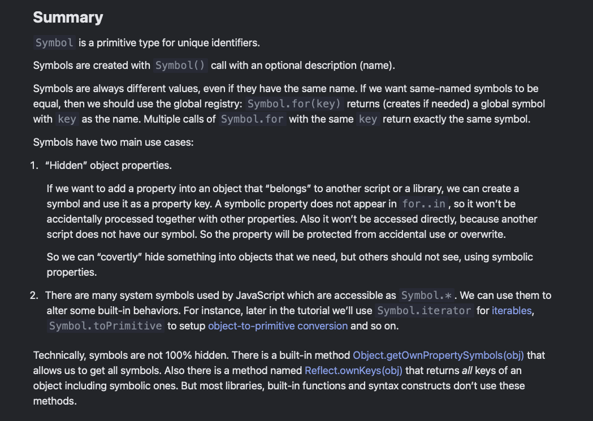

## Object to primitive conversion

- any math operation on objects will not result in another object

### Conversion rules

1. There’s no conversion to boolean. All objects are ```true``` in a boolean context, as simple as that. There exist only numeric and string conversions.

2. The numeric conversion happens when we subtract objects or apply mathematical functions. For instance, ```Date``` objects can be subtracted, and the result of ```date1 - date2``` is the time difference between two dates.

3. As for the string conversion – it usually happens when we output an object with ```alert(obj)``` and in similar contexts.

### Hints

- there are three variants of type conversion, that happen in various situations called hints

"string" – for string conversion

```javascript
alert(obj); // hint: "string"

// using object as a property key
anotherObj[obj] = 123;
```

"number" – for numeric conversion

```javascript
// explicit conversion
let num = Number(obj);

// maths (except binary plus)
let n = +obj; // unary plus
let delta = date1 - date2;

// less/greater comparison
let greater = user1 > user2;
```

"default" – for both conversions, depending on the situation

- rare case when the operator is "not sure" what to expect

- eg, binary plus ```+``` can work both with strings (concatenates them) and numbers (adds them). So if a binary plus gets an object as an argument, it uses the ```"default"``` hint to convert it.

```javascript
// binary plus uses the "default" hint
let total = obj1 + obj2;

// obj == number uses the "default" hint
if (user == 1) { ... };
```

The greater and less comparison operators, such as ```<``` ```>```, can work with both strings and numbers too. Still, they use the ```"number"``` hint, not ```"default"```. That’s for historical reasons.

> To do the conversion, JavaScript tries to find and call three object methods:

1. Call ```obj[Symbol.toPrimitive](hint)``` – the method with the symbolic key ```Symbol.toPrimitive``` (system symbol), if such method exists,

2. Otherwise if hint is ```"string"```
try calling ```obj.toString()``` or ```obj.valueOf()```, whatever exists.

3. Otherwise if hint is ```"number"``` or ```"default"```
try calling ```obj.valueOf()``` or ```obj.toString()```, whatever exists.

### Symbol.toPrimitive

- used to name the conversion method

```javascript
obj[Symbol.toPrimitive] = function(hint) {
  // here goes the code to convert this object to a primitive
  // it must return a primitive value
  // hint = one of "string", "number", "default"
};
```

If the method Symbol.toPrimitive exists, it’s used for all hints, and no more methods are needed.

For instance, here user object implements it:

```javascript
 let user = {
  name: "John",
  money: 1000,

  [Symbol.toPrimitive](hint) {
    alert(`hint: ${hint}`);
    return hint == "string" ? `{name: "${this.name}"}` : this.money;
  }
};

// conversions demo:
alert(user); // hint: string -> {name: "John"}
alert(+user); // hint: number -> 1000
alert(user + 500); // hint: default -> 1500
```

As we can see from the code, user becomes a self-descriptive string or a money amount, depending on the conversion. The single method ```user[Symbol.toPrimitive]``` handles all conversion cases.

### toString/valueOf

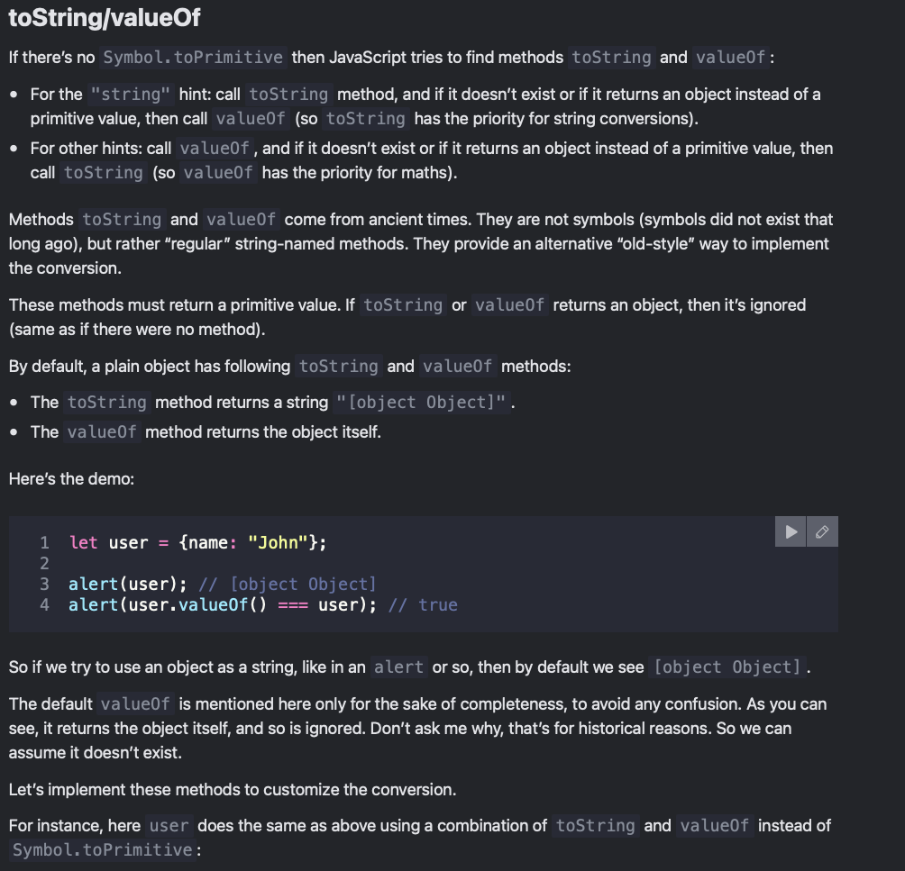
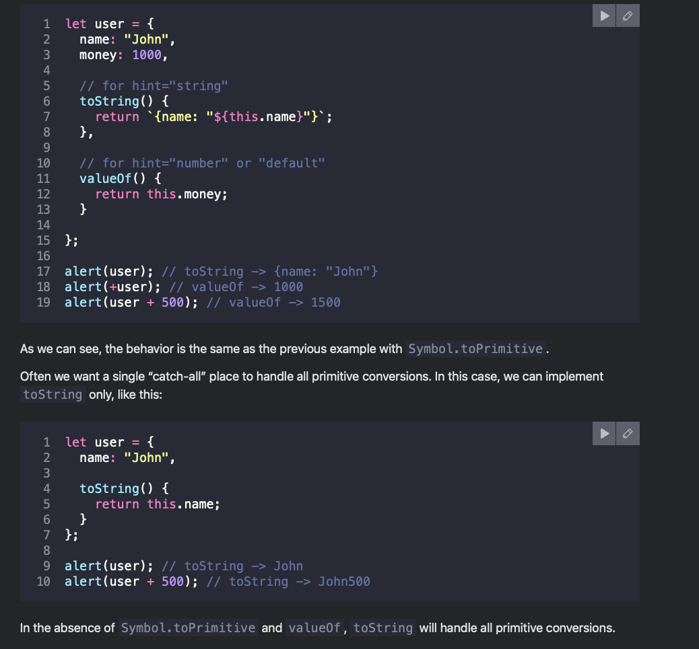

---

## The Big Picture: What is happening here?

In JavaScript, you often try to use an __object__ (like `{name: "John"}`) in a place where a __primitive__ value (like a string or a number) is expected.

For example:

- `alert(user)` $\rightarrow$ You are trying to print the user object as a __string__.
- `user + 500` or `+user` $\rightarrow$ You are trying to math-calculate with the object as a __number__.

JavaScript doesn't just crash when you do this. Instead, it tries to automatically convert your object into a string or a number. To figure out *how* to convert it, JavaScript looks for a __"hint"__ of what type is needed, and then looks for specific methods inside your object to do the job.

---

## The Two Methods: `toString` and `valueOf`

Before modern JavaScript added newer features like `Symbol.toPrimitive`, JavaScript relied on two old-school methods to handle these conversions:

1. __`toString()`__: This method's job is to return a __string__ representation of the object.
2. __`valueOf()`__: This method's job is to return a __numeric__ (or basic primitive) representation of the object.

### The Priority Rules

When JavaScript needs a primitive, it follows a specific order depending on what it needs:

- __If it wants a "string":__ It calls `toString()`. If that fails (or doesn't exist), it tries `valueOf()`.
- __If it wants a "number" (math):__ It calls `valueOf()`. If that fails, it tries `toString()`.

---

## Default Behavior (Why you see `[object Object]`)

By default, every object you create in JavaScript already has built-in versions of these two methods.

If you don't write your own, here is what JavaScript does out-of-the-box:

- The default `toString()` just gives you the text `"[object Object]"`.
- The default `valueOf()` just returns the object itself (which JavaScript ignores because it's not a primitive).

```javascript
let user = { name: "John" };

alert(user); // Output: "[object Object]" 
// (Because JavaScript wanted a string, called the default toString(), and got "[object Object]")

```

---

## Customizing the Conversion (The Code Examples)

The code snippets you shared show how we can __override__ those default behaviors so the object behaves intelligently when used in math or strings.

### Example 1: Handling Strings and Numbers separately

```javascript
let user = {
  name: "John",
  money: 1000,

  // JavaScript triggers this when it needs text/string
  toString() {
    return `{name: "${this.name}"}`;
  },

  // JavaScript triggers this when it needs math/numbers
  valueOf() {
    return this.money;
  }
};

alert(user);       // Output: {name: "John"}  <- Triggered toString()
alert(+user);      // Output: 1000            <- Triggered valueOf() (the '+' forces it to a number)
alert(user + 500); // Output: 1500            <- Triggered valueOf() (1000 + 500)

```

### Example 2: The "Catch-All" shortcut

If you only implement `toString()`, JavaScript will use it for __everything__ if `valueOf` isn't giving a valid primitive.

```javascript
let user = {
  name: "John",

  toString() {
    return this.name; // returns "John"
  }
};

alert(user);       // Output: "John" (Wanted a string)
alert(user + 500); // Output: "John500" 
// (Wanted a number for math, looked for valueOf, didn't find a useful one, 
// fell back to toString(), got "John", and then glued "John" + 500 together).

```

---

## Summary Cheat Sheet

> - __Why does this exist?__ To let you decide what happens when an object is treated like a string or a number.
> - __`toString()`__ $\rightarrow$ High priority for __text__ conversion.
> - __`valueOf()`__ $\rightarrow$ High priority for __math__ conversion.
> - __The Golden Rule:__ Both methods *must* return a primitive value (like a string, number, or boolean), not another object. If they return an object, JavaScript just ignores them.
>
>

---

> [!NOTE]

A conversion can return any primitive type

The important thing to know about all primitive-conversion methods is that they do not necessarily return the “hinted” primitive.

There is no control whether toString returns exactly a string, or whether Symbol.toPrimitive method returns a number for the hint "number".

The only mandatory thing: these methods must return a primitive, not an object.

Historical notes
For historical reasons, if toString or valueOf returns an object, there’s no error, but such value is ignored (like if the method didn’t exist). That’s because in ancient times there was no good “error” concept in JavaScript.

In contrast, Symbol.toPrimitive is stricter, it must return a primitive, otherwise there will be an error.

---

### Further conversions

If we pass an object as an argument, then there are two stages of calculations:

1. The object is converted to a primitive (using the rules described above).
2. If necessary for further calculations, the resulting primitive is also converted.

For instance:

```javascript
 let obj = {
  // toString handles all conversions in the absence of other methods
  toString() {
    return "2";
  }
};

alert(obj * 2); // 4, object converted to primitive "2", then multiplication made it a number
```

The multiplication ```obj * 2``` first converts the object to primitive (that’s a string ```"2"```).
Then ```"2" * 2``` becomes ```2 * 2``` (the string is converted to number).

Binary plus will concatenate strings in the same situation, as it gladly accepts a string:

```javascript
 let obj = {
  toString() {
    return "2";
  }
};

alert(obj + 2); // "22" ("2" + 2), conversion to primitive returned a string => concatenation
```

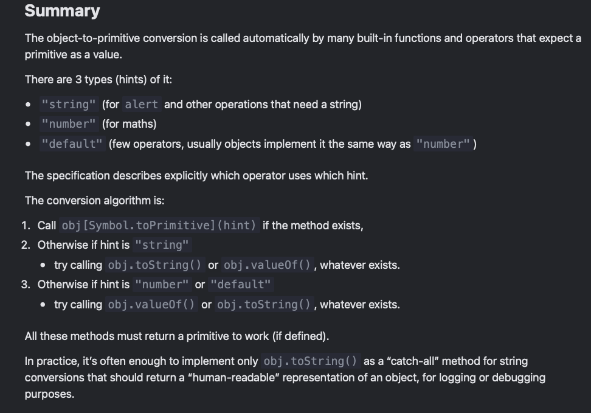