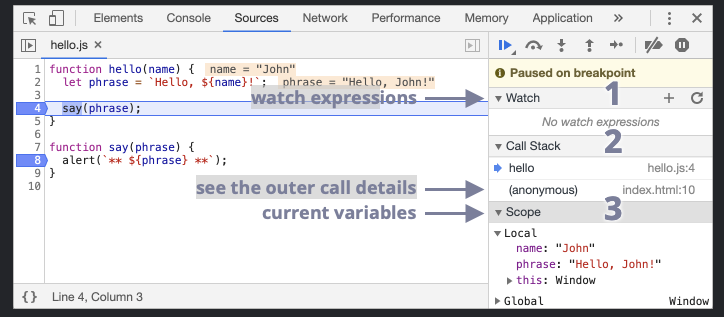
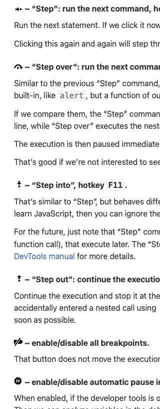
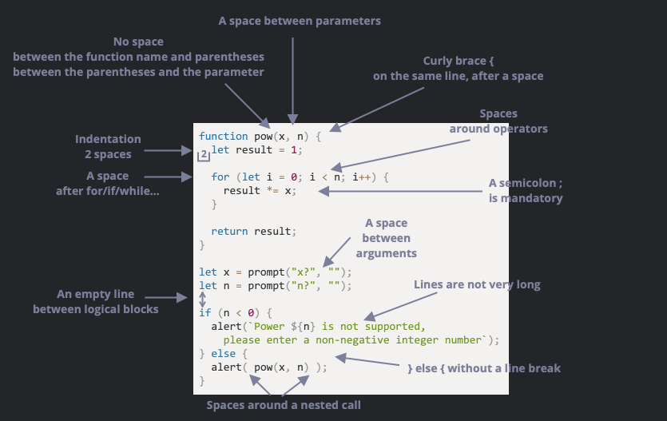
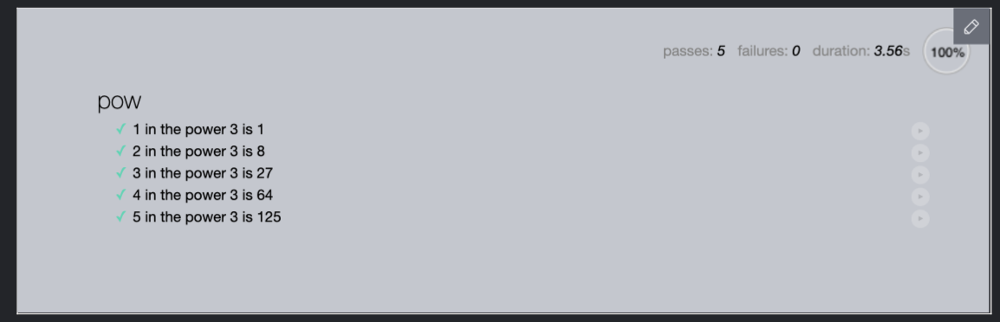
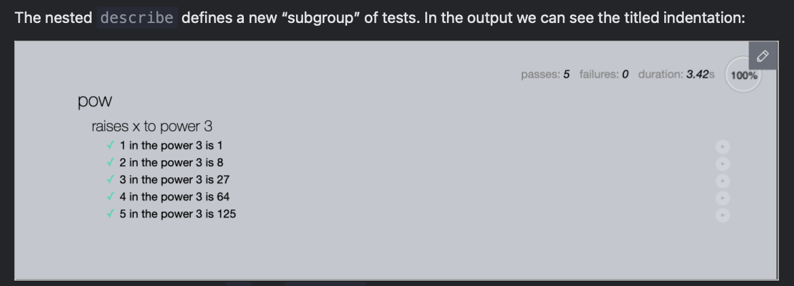
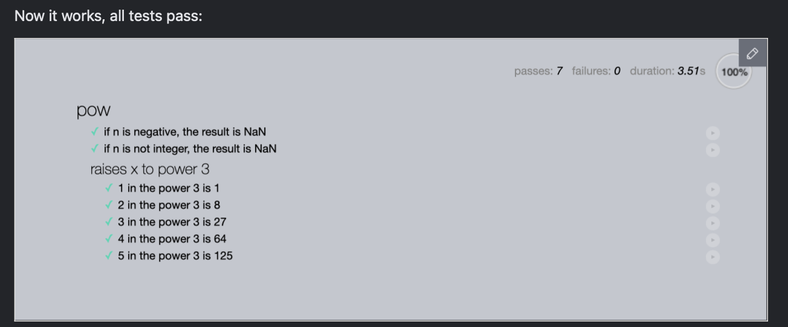

# Javascript by [javascript.info](https://javascript.info/)

## Code Quality

### Debugging in the browser

We can also pause the code by using the debugger command in it, like this:

```javascript
function hello(name) {
  let phrase = `Hello, ${name}!`;

  debugger;  // <-- the debugger stops here

  say(phrase);
}
```

Such command works only when the development tools are open, otherwise the browser ignores it.



1. Watch – shows current values for any expressions.

    You can click the plus + and input an expression. The debugger will show its value, automatically recalculating it in the process of execution.

2. Call Stack – shows the nested calls chain.

    At the current moment the debugger is inside hello() call, called by a script in index.html (no function there, so it’s called “anonymous”).

    If you click on a stack item (e.g. “anonymous”), the debugger jumps to the corresponding code, and all its variables can be examined as well.

3. Scope – current variables.

    Local shows local function variables. You can also see their values highlighted right over the source.

    Global has global variables (out of any functions).

#### Tracing the code execution

- Resume”: continue the execution, hotkey F8.

    Resumes the execution. If there are no additional breakpoints, then the execution just continues and the debugger loses control.



- “Step”: run the next command, hotkey F9.
    Run the next statement. If we click it now, alert will be shown.

    Clicking this again and again will step through all script statements one by one.

- “Step over”: run the next command, but don’t go into a function, hotkey F10.
    Similar to the previous “Step” command, but behaves differently if the next statement is a function call (not a built-in, like alert, but a function of our own).

    If we compare them, the “Step” command goes into a nested function call and pauses the execution at its first line, while “Step over” executes the nested function call invisibly to us, skipping the function internals.

    The execution is then paused immediately after that function call.

    That’s good if we’re not interested to see what happens inside the function call.

- “Step into”, hotkey F11.
    That’s similar to “Step”, but behaves differently in case of asynchronous function calls. If you’re only starting to learn JavaScript, then you can ignore the difference, as we don’t have asynchronous calls yet.

    For the future, just note that “Step” command ignores async actions, such as setTimeout (scheduled function call), that execute later. The “Step into” goes into their code, waiting for them if necessary. See DevTools manual for more details.

- “Step out”: continue the execution till the end of the current function, hotkey Shift+F11.
    Continue the execution and stop it at the very last line of the current function. That’s handy when we accidentally entered a nested call using , but it does not interest us, and we want to continue to its end as soon as possible.

- enable/disable all breakpoints.
    That button does not move the execution. Just a mass on/off for breakpoints.

- “Enable/disable automatic pause in case of an error”.
    When enabled, if the developer tools is open, an error during the script execution automatically pauses it. Then we can analyze variables in the debugger to see what went wrong. So if our script dies with an error, we can open debugger, enable this option and reload the page to see where it dies and what’s the context at that moment.

- console logging with console.log()

### Coding Style



```javascript
// backtick quotes ` allow to split the string into multiple lines
let str = `
  ECMA International's TC39 is a group of JavaScript developers,
  implementers, academics, and more, collaborating with the community
  to maintain and evolve the definition of JavaScript.
`;
```

Linters are tools that can automatically check the style of your code and make improving suggestions.

### Comments

Comments are used to explain the code, and they are ignored by the JavaScript engine.

single-line: starting with ```//``` and multiline: ```/* ... */.```

### Document function parameters and usage

- did not understand, something about JSDoc, way to document code

### Ninja code

- sarcastic piece of advice about writing code that is so concise and clever that it’s hard to understand.

### Automated testing with Mocha

- Automated testing means that tests are written separately, in addition to the code. They run our functions in various ways and compare results with the expected.

- Mocha is a testing framework for JavaScript. It allows us to write tests in a structured way and provides tools for running them and reporting results.

#### Behavior Driven Development (BDD)

BDD is three things in one: tests AND documentation AND examples.

- a specification or, in short, a spec, contains descriptions of use cases together with tests for them, like this:

```javascript
describe("pow", function() {

  it("raises to n-th power", function() {
    assert.equal(pow(2, 3), 8);
  });

});
```

```javascript
describe("title", function() { ... })
```

What functionality we’re describing? In our case we’re describing the function pow. Used to group “workers” – the it blocks.

```javascript
it("use case description", function() { ... })
```

In the title of it we in a human-readable way describe the particular use case, and the second argument is a function that tests it.

```javascript
assert.equal(value1, value2)
```

The code inside ```it``` block, if the implementation is correct, should execute without errors.

Functions ```assert.*``` are used to check whether ```pow``` works as expected. Right here we’re using one of them – ```assert.equal```, it compares arguments and yields an error if they are not equal. Here it checks that the result of ```pow(2, 3)``` equals 8. There are other types of comparisons and checks, that we’ll add later.

#### The development flow

The flow of development usually looks like this:

1. An initial spec is written, with tests for the most basic functionality.
2. An initial implementation is created.
3. To check whether it works, we run the testing framework Mocha (more details soon) that   runs the spec. While the functionality is not complete, errors are displayed. We make corrections until everything works.
4. Now we have a working initial implementation with tests.
5. We add more use cases to the spec, probably not yet supported by the implementations. Tests start to fail.
6. Go to 3, update the implementation till tests give no errors.
7. Repeat steps 3-6 till the functionality is ready.

#### The spec in action

Here in the tutorial we’ll be using the following JavaScript libraries for tests:

- Mocha – the core framework: it provides common testing functions including describe and it and the main function that runs tests.
- Chai – the library with many assertions. It allows to use a lot of different assertions, for now we need only assert.equal.
- Sinon – a library to spy over functions, emulate built-in functions and more, we’ll need it much later.

```html
<!DOCTYPE html>
<html>
<head>
  <!-- add mocha css, to show results -->
  <link rel="stylesheet" href="https://cdnjs.cloudflare.com/ajax/libs/mocha/3.2.0/mocha.css">
  <!-- add mocha framework code -->
  <script src="https://cdnjs.cloudflare.com/ajax/libs/mocha/3.2.0/mocha.js"></script>
  <script>
    mocha.setup('bdd'); // minimal setup
  </script>
  <!-- add chai -->
  <script src="https://cdnjs.cloudflare.com/ajax/libs/chai/3.5.0/chai.js"></script>
  <script>
    // chai has a lot of stuff, let's make assert global
    let assert = chai.assert;
  </script>
</head>

<body>

  <script>
    function pow(x, n) {
      /* function code is to be written, empty now */
    }
  </script>

  <!-- the script with tests (describe, it...) -->
  <script src="test.js"></script>

  <!-- the element with id="mocha" will contain test results -->
  <div id="mocha"></div>

  <!-- run tests! -->
  <script>
    mocha.run();
  </script>
</body>

</html>
```

The page can be divided into five parts:

1. The ```<head>``` – add third-party libraries and styles for tests.
2. The ```<script>``` with the function to test, in our case – with the code for pow.
3. The tests – in our case an external script test.js that has describe("pow", ...) from above.
4. The HTML element ```<div id="mocha">``` will be used by Mocha to output results.
5. The tests are started by the command ```mocha.run()```.

- let’s note that there are more high-level test-runners, like karma and others, that make it easy to autorun many different tests.

```javascript
function pow(x, n) {
  return 8; // :) we cheat!
}
```

- shows how the test could pass even when the function is not implemented correctly. That’s why we need more tests, to cover more use cases.

```javascript
describe("pow", function() {

  it("2 raised to power 3 is 8", function() {
    assert.equal(pow(2, 3), 8);
  });

  it("3 raised to power 4 is 81", function() {
    assert.equal(pow(3, 4), 81);
  });

});
```

- the golden rule is one test checks one thing.

```javascript
describe("pow", function() {

  function makeTest(x) {
    let expected = x * x * x;
    it(`${x} in the power 3 is ${expected}`, function() {
      assert.equal(pow(x, 3), expected);
    });
  }

  for (let x = 1; x <= 5; x++) {
    makeTest(x);
  }

});
```

- the above is a crazy piece of code.



#### Nested describe

the helper function ```makeTest``` and ```for``` should be grouped together. We won’t need ```makeTest``` in other tests, it’s needed only in for: their common task is to check how ```pow``` raises into the given power.

Grouping is done with a nested describe:

```javascript
describe("pow", function() {

  describe("raises x to power 3", function() {

    function makeTest(x) {
      let expected = x * x * x;
      it(`${x} in the power 3 is ${expected}`, function() {
        assert.equal(pow(x, 3), expected);
      });
    }

    for (let x = 1; x <= 5; x++) {
      makeTest(x);
    }

  });

  // ... more tests to follow here, both describe and it can be added
});
```



#### before/after and beforeEach/afterEach

We can setup ```before/after``` functions that execute ```before/after``` running tests, and also ```beforeEach/afterEach``` functions that execute ```before/after``` every it.

For instance:

```javascript
describe("test", function() {

  before(() => alert("Testing started – before all tests"));
  after(() => alert("Testing finished – after all tests"));

  beforeEach(() => alert("Before a test – enter a test"));
  afterEach(() => alert("After a test – exit a test"));

  it('test 1', () => alert(1));
  it('test 2', () => alert(2));

});
```

The running sequence will be:

```text
Testing started – before all tests (before)
Before a test – enter a test (beforeEach)
1
After a test – exit a test   (afterEach)
Before a test – enter a test (beforeEach)
2
After a test – exit a test   (afterEach)
Testing finished – after all tests (after)
```

Open the example in the sandbox.
Usually, ```beforeEach/afterEach``` and ```before/after``` are used to perform initialization, zero out counters or do something else between the tests (or test groups).

#### Extending the spec test

the function pow(x, n) is meant to work with positive integer values n.

To indicate a mathematical error, JavaScript functions usually return NaN. Let’s do the same for invalid values of n.

```javascript
describe("pow", function() {

  // ...

  it("for negative n the result is NaN", function() {
    assert.isNaN(pow(2, -1));
  });

  it("for non-integer n the result is NaN", function() {
    assert.isNaN(pow(2, 1.5));
  });

});
```

- the tests immediately fail as the implementation does not support the new cases.

**That’s how BDD is done: first we write failing tests, and then make an implementation for them.**

>[!NOTE]
>
> Other assertions
> Please note the assertion assert.isNaN: it checks for NaN.
> There are other assertions in Chai as well, for instance:
> assert.equal(value1, value2) – checks the equality value1 == value2.
> assert.strictEqual(value1, value2) – checks the strict equality value1 === value2.
> assert.notEqual, assert.notStrictEqual – inverse checks to the ones above.
> assert.isTrue(value) – checks that value === true
> assert.isFalse(value) – checks that value === false
> and more

```javascript
function pow(x, n) {
  if (n < 0) return NaN;
  if (Math.round(n) != n) return NaN;

  let result = 1;

  for (let i = 0; i < n; i++) {
    result *= x;
  }

  return result;
}
```



>IMPORTANT
>
>Writing tests requires good JavaScript knowledge. But we’re just starting to learn it. So, to settle down everything, as of now you’re not required to write tests, but you should already be able to read them even if they are a little bit more complex than in this chapter.

we can isolate a single test and run it in standalone mode by writing it.only instead of it:

```javascript
describe("Raises x to power n", function() {
  it("5 in the power of 1 equals 5", function() {
    assert.equal(pow(5, 1), 5);
  });

  // Mocha will run only this block
  it.only("5 in the power of 2 equals 25", function() {
    assert.equal(pow(5, 2), 25);
  });

  it("5 in the power of 3 equals 125", function() {
    assert.equal(pow(5, 3), 125);
  });
});
```

### Polyfills and Transpilers

- the above are two ways for modern code to work on older engines.

#### Transpilers

- a special piece of software that translates source code to another source code. It can parse (“read and understand”) modern code and rewrite it using older syntax constructs, so that it’ll also work in outdated engines.

- E.g. JavaScript before year 2020 didn’t have the “nullish coalescing operator” ```??```. So, if a visitor uses an outdated browser, it may fail to understand the code like ```height = height ?? 100.```

- A transpiler would analyze our code and rewrite ```height ?? 100``` into ```(height !== undefined && height !== null) ? height : 100```

Babel is one of the most prominent transpilers out there.

Modern project build systems, such as webpack, provide a means to run a transpiler automatically on every code change, so it’s very easy to integrate into the development process.

#### Polyfills

- A script that updates/adds new functions is called “polyfill”. It “fills in” the gap and adds missing implementations.

- For example, Math.trunc(n) is a function that “cuts off” the decimal part of a number, e.g Math.trunc(1.23) returns 1.

- polyfill as there's no need to change the syntax, just declare the missing function

```javascript
if (!Math.trunc) { // if no such function
  // implement it
  Math.trunc = function(number) {
    // Math.ceil and Math.floor exist even in ancient JavaScript engines
    // they are covered later in the tutorial
    return number < 0 ? Math.ceil(number) : Math.floor(number);
  };
}
```

JavaScript is a highly dynamic language. Scripts may add/modify any function, even built-in ones.

One interesting polyfill library is core-js, which supports a wide range of features and allows you to include only the ones you need.

> I kinda don't understand the above statement, hopefully i will when i revisit.

and that ends Code Quality section.
